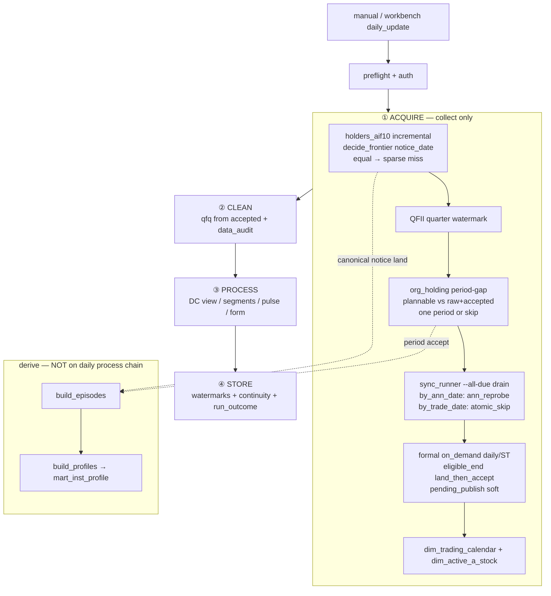

# Adversarial review A — structural / first-principles

> Status: evidence-only / Agent A (structural, not red-team)  
> Date: 2026-07-23  
> Skills: `$mio` · `$chunkymonkey-governance` · `data-acquisition-integrity`  
> Authority: `AGENTS.md` → `goal.md` → `docs/MASTER_TOPLEVEL_DESIGN.md` + `engineering_governance.md`  
> Live code: `frontier_decision.py`, `pipeline/acquire|clean|process|store`, `sync_runner`, `holders_aif10`, `org_holding_aif10`, formal land→accept, `institution_profile`  
> Peer evidence (context, not rewritten): `data_frontier_detection_system_20260723.md`, `unified_frontier_detection_acceptance_20260723.md`, `shareholder_update_check_design_20260723.md`, `inst_profile_coverage_lift_20260723.md`, `org_holding_incremental_loop_20260723.md`

---

## 0. One-line verdict

**PARTIAL** — the Tier0 acquire spine (`land → validate → accepted → serve`) plus typed soft clocks is contract-aligned and Occam-sound for the domains that wired `frontier_decision`; derive/process closure and soft-outcome rollup still leave integrity signals easy to misread as “waiting for clock.”

---

## 1. Current flow map

### Soft vs hard outcomes (single compute: `run_outcome.py`)

| Class | Examples | Pipeline behavior |
|---|---|---|
| **Soft clock** (typed) | `pending_publish`, `pre_available_after_zero_rows`, `same_day_vendor_vacuum` | continue siblings; exit 1; not FAIL banner |
| **Hard block** | AUTH / PREFLIGHT / TIER0 / WRITER | exit 2–5; wrapper FAIL |
| **Ops observe → rolled soft** | drain residual, continuity FAIL, data_audit FAIL, holders/org `ctx.step` degrade | chain continues; **named** `soft_waiting_clock` even when msg is not a clock |

Formal catchup (2026-07-22 structural): drain **before** daily/ST; domain `pending_publish` / hard fail does **not** abort drain or raise `Tier0AcquireError` for ordinary outcomes.

---

## 2. What is sound / contract-aligned

1. **Transport ≠ business tiers** — formal daily/ST use `land_then_accept_authorized_security_day` (capture→land→accept); landing preserves provider response; universe filter is not acquire blacklist (MASTER §5.1).
2. **Clock ≠ population** — `decide_frontier` outcomes (`pending_clock` / `equal_day_population_gap` / `advance_window` / `skip_behind` / `hard_fail`) match the owner model: local max(axis) → rule → should-have → fetch gap; not wall-clock「对昨天」.
3. **Type-aware day policy** (data-acquisition-integrity 分型) — dense `by_trade_date` → `atomic_skip`; sparse `by_ann_date` → `ann_reprobe` (keep wm day). Holders equal-wm sparse miss is the same bug class as ann late-filers, now shared.
4. **Holders path honesty** — watermark = formal canonical `MAX(notice_date)`; `_write` → formal land→accept; ops counters split rewrite amplification vs `net_new_notice_rows`; daily full-universe per-stock scan correctly **banned**.
5. **Org period-gap** — every-run check; fetch **one** plannable period or accept-from-raw or skip+next unlock; by-date invent + mass ~830k refresh **banned**; equal period remapped to existence (`skip_behind`), not population invent.
6. **Fail-closed distinctions** — 0-row same-day vacuum → typed `pending_publish` (not `known_empty` tombstone / not `failed_batches`); probe_failed → `hard_fail`; margin product frozen → hard-gate skipped (not thawed).
7. **Process gates that exist** — clean `data_audit` FAIL raises into `degraded` (no longer silent check_pass); pulse late window always runs (CX-1); form builds `from_accepted=True`.
8. **Institution profile honesty** (derive layer) — display membership lifted to episode coverage; ranking still gated; no alpha invent. Correct separation of serve honesty vs Tier0 acquire.

---

## 3. Gaps / overconstraints / false greens (ranked)

### P0 — integrity semantics (not just UX)

| # | Finding | Why it matters | Evidence |
|---|---|---|---|
| **A1** | **`run_outcome` soft bucket conflates clock-wait with integrity observe** | Continuity FAIL / data_audit FAIL / holders sync fail / drain residual all can render as `soft_waiting_clock`. UI/notify correctly avoid false FAIL — but **ops soft clock ≠ accepted truth OK**. Risk: human reads “等时钟” and stops digging real holes. | `run_outcome.py` adversarial note + rollup: any non-hard → soft |
| **A2** | **Institution episode→profile derive not on daily process** | Acquire can advance holders/org canonical; dossier deep-link/`mart_inst_profile` stays stale until **manual** rebuild. Coverage lift FIXED membership rules; **freshness loop** still open. | `pipeline/process.py` has no `build_episodes`/`build_profiles`; inst analysis = one-shot rebuild |
| **A3** | **Org period existence ≠ within-period population** | Known and correctly banned from daily invent — still a **true integrity hole** for thin/late-filer periods until explicit repair knife. Soft skip when `accepted_has_plannable` is correct ops, not completeness proof. | `org_holding_period_gap_report` + design docs; frontier hook remaps equal→existence |

### P1 — structural incompleteness / false calm

| # | Finding | Why it matters | Evidence |
|---|---|---|---|
| **A4** | **Disclosure acquire still dual-shaped** | Holders/org/QFII are acquire side-steps; registry drain is sync_runner. Shared `frontier_decision` wired on holders + ann/trade policies, but **one runner contract** (G5) still open — easier for future paths to drift clocks/watermarks. | `acquire.py` steps vs `run_domain`; frontier mapping G5 |
| **A5** | **`by_trade_date` atomic_skip assumes full-day atomic land** | Equal-day population re-probe intentionally **not** done for dense trade_date. Sound Occam **until** miss ledger proves non-atomic mid-day truncate. Then false green: wm advanced, same-day gap invisible. | `plan_incremental_days` atomic_skip; acceptance residual |
| **A6** | **Typed `availability_policy` coverage still narrow (G4)** | Formal daily/ST/margin have clocks; many registry domains still watermark/SLA observers. Clock gate ≠ population gate is documented; residual = domains without typed publication axis can look “due/fresh” for wrong reasons. | frontier mapping G4; watermark SLA vs eligibility |
| **A7** | **Holders/org/QFII failures are `ctx.step` degrade, not Tier0 hard** | Aligns with “don’t kidnap drain” — but disclosure Tier0-ish miss can leave clean/process running on stale canonical without hard stop. Soft continue is intentional; **must not be read as fail-closed completeness**. | `acquire.py` degraded_msg on holders/org/QFII |

### P2 — overconstraints that are *correct* (not bugs)

| # | Item | Assessment |
|---|---|---|
| **A8** | Ban daily ~5k per-stock announcement scan | **Not overconstraint** — Occam; holders already market-level `UPDATE_DATE≥` sparse; org has no NOTICE faucet |
| **A9** | Ban org by-date invent / mass refresh | **Not overconstraint** — contract + cost + false-green risk |
| **A10** | Formal catchup log-not-fill historical holes | **Correct** — explicit backfill knife; avoid silent mass |

### False-green checklist (what green does / does not prove)

| Green signal | Proves | Does **not** prove |
|---|---|---|
| `pending_publish` soft | clock/vacuum typed | population complete after clock opens |
| holders `same_day_coverage_complete` | provider UPDATE_DATE≥wm codes ⊆ local canonical for that notice | provider page incomplete / codes outside probe filter |
| org `skip_current` | latest plannable period exists in accepted | row count / late filers inside period |
| drain status ok + atomic_skip | wm day skipped under dense assumption | same-day truncated batch if assumption false |
| `run_outcome=soft_waiting_clock` | no AUTH/PREFLIGHT/TIER0/WRITER hard | continuity / audit / disclosure integrity |
| profile mart 99% of episodes | display deep-link membership | daily freshness after new lands; skill ranking |

---

## 4. Ops soft clocks vs true integrity holes

### Ops soft clocks (expected, not defects)

- Formal daily/ST **pre-`available_after` / same-day vendor vacuum** → `pending_publish`
- Org **no new plannable period** → skip + `next_period_unlock` (disclosure calendar)
- Holders **provider_max < wm** → `watermark_unchanged` (provider behind formal)
- Weekend/holiday / non-open calendar → no eligible_end
- Margin product **frozen** → hard-gate skipped (not a thaw)

### True integrity holes (must not be narrated as soft clocks)

| Hole | Current mitigation | Residual |
|---|---|---|
| Same-day sparse late filers (ann / holders) | `ann_reprobe` + holders equal-day sparse | probe completeness / BSE out-of-dim |
| Org thin / mid-period late land | period-gap only; repair knife | **open** until miss ledger + safe faucet |
| Dense trade_date mid-day truncate | atomic_skip assumption | evidence-gated only |
| Continuity / post-sync audit FAIL | store degrade → soft rollup | **signal class wrong for humans** (A1) |
| Episode/profile lag after land | manual rebuild | **derive loop open** (A2) |
| Dual acquire surfaces drift | shared frontier subset | G5 still open (A4) |

---

## 5. Verdict + top knives

**Verdict: PARTIAL**

- Not **REASONABLE**: soft-outcome conflation + derive not closed after disclosure land + org/trade_date population assumptions remain honesty-critical.
- Not **UNSOUND**: transport spine, typed pending, frontier primitive, type-aware ann vs trade policies, and mass/by-date bans match MASTER + data-acquisition-integrity lessons.

### Top 3 next knives (only if owner schedules)

1. **Outcome class split (small, high leverage)** — Keep soft clock for true `pending_publish` / vacuum; promote continuity / `data_audit` / disclosure step failures to a distinct observe class (name ≠ `soft_waiting_clock`) so workbench/notify cannot narrate integrity holes as “等时钟.” No north-star rewrite.
2. **Delta-gated institution derive on process_plan** — When holders/org acquire summary shows advanced partitions / net-new notices, run `build_profiles` (and episodes if needed) as process step with skip-when-unchanged. Display freshness only; ranking gates unchanged; no Type-B invent.
3. **Evidence-gated population repair (pick one)** — Either (a) ≥90d miss ledger for org thin/late-period → explicit one-period repair knife, or (b) by_trade_date equal-day miss ledger before changing `atomic_skip`. Do **not** invent org by-date; do **not** daily full-universe scan.

Out of scope / do not open: Optuna, Continuity READY from commit, margin thaw, S7 fake COMPAT, mass org refresh, north-star rewrite.

---

## 6. Label

**PARTIAL** — structural acquire/check spine is aligned; residual owners = soft-vs-integrity signal hygiene + derive closure + evidence-gated population holes.  
Next verification: one open-session canary — morning `pending_publish` stays soft; post-clock daily accept; holders equal-wm sparse path logs; workbench does not label continuity FAIL as pure clock-wait; profile mart freshness after holders advance (today: manual).
