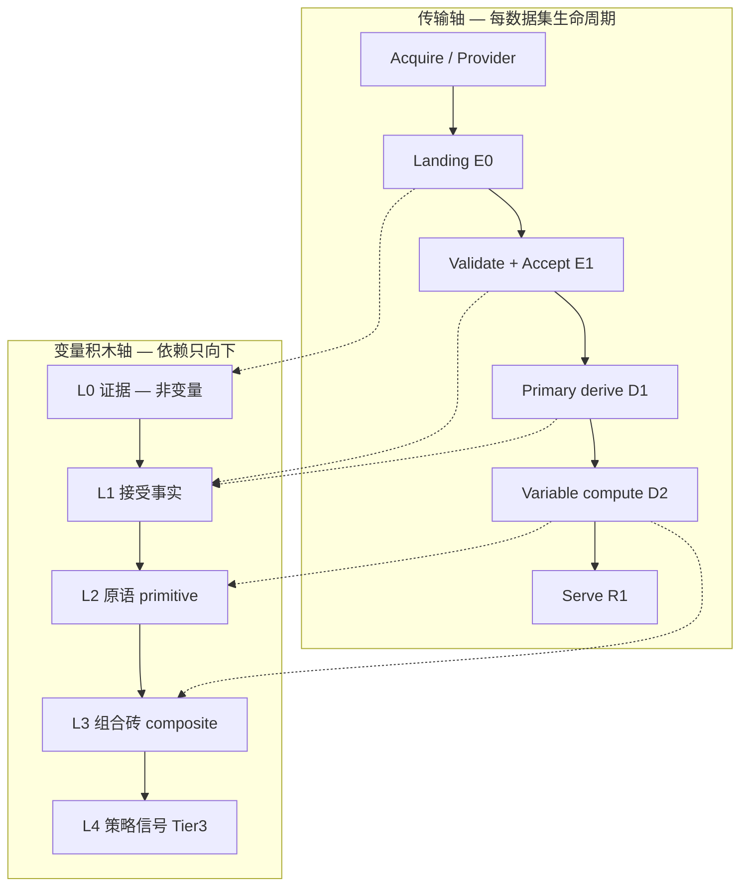

# 数据积木架构权威设计（2026-07-21）

> **生命周期**：evidence-only / **变量分层 + 积木组合 + 模块独立 operability 权威**（由 `goal.md` 指针授权；不替代 `docs/MASTER_TOPLEVEL_DESIGN.md` 业务 Tier 立法；物理 DuckDB 边界见 `analysis/db_layering_toplevel_design_20260721.md`）  
> **证据输入**：`plan_reeval_first_principles_20260720.md`、`data_foundation_modularity_gap_20260720.md`、`db_layering_toplevel_design_20260721.md`、`docs/strategy_validation_contract.md`、live S1–S7/E0 状态（`goal.md`）  
> **禁令延续**：greenfield 第五产品、plugin bus、第二 DB、dual-write 迁移窗、YAML-as-language、无限变量 DAG、Optuna-as-truth

---

## 0. 一句话裁决（steelman + 专家延伸）

**业主四段拆分（水龙头 → 证据/raw → 清洗/接受 → 按需变量加工）在语义上正确，且与 MASTER 传输轴 + 积木五件套同构——不是第五产品，也不是「变量禁止互依、必须每次从 raw 重算」。**

**推荐变量/积木层数：4 层（L0–L3）+ 独立的研究产物层 L4；禁止 L5+ 与无限 DAG。**  
传输生命周期（acquire / accept / derive / serve）与变量语义层正交；编排器（`chunkyctl sync` / `daily_update`）**caller-only**，每步可 CLI 单测。

| 维度 | 裁决 |
|---|---|
| Owner 四模块模型 | **VALID** — 对齐 MASTER §3.1 transport + pipeline 四阶段 |
| 「变量必须互不复用、只从 raw 算」 | **REJECT** — 与 owner 澄清相反；**要**分层组合（brick），**禁** silent raw bypass |
| 合理层数 | **4**（L0 证据 → L1 接受事实 → L2 原语 → L3 组合砖）；L4 = Tier3 策略信号/实验产物，**不是**通用变量仓库 |
| 物理一库一层 | **REJECT** — 见 DB 分层文 §3.2 |
| 近端路径 | **S7/E0 strangler 续刀**，不重启 A→H 策略轨 |

---

## 1. 确认：Owner 拆分 ↔ MASTER transport ↔ 积木层

### 1.1 Owner 四段 ↔ 仓库已有 seam（最强 steel-man）

| Owner 口语 | 最强解读 | MASTER / 已 shipped seam | 逻辑层 ID |
|---|---|---|---|
| **1. 数据源（可插拔水龙头）** | ProviderAdapter 只做 request→response→landing schema；不在 landing 做 universe 业务过滤 | S4 `security_day_acquire`；`data_access.yaml` 水龙头语义（SERVE partial）；E0 disclosure land | **Acquire → E0** |
| **2. Raw / 证据 DB** | 供应商事实可重放；population=`raw_evidence`；≠ 项目业务 SSOT | `landing_*`、`ingest_batch`、legacy `raw_tushare_*`（S7 日落中） | **E0 Evidence** |
| **3. 清洗/加工 → 可用项目事实** | `stage→validate→publish→accepted_partition` 原子链；项目接受真相 | S2 accept-from-landing；S5 derive-from-accepted（qfq/form）；canonical + partition | **E1 Accepted + D1 Primary derive** |
| **4. 按需变量加工（积木/可组合）** | Tier1/2 发布 + FeatureBlock；可读下层砖；带 `available_at` + config hash + lineage | `market_pulse` mart、Tier12 publish、`feature_store` Type B | **D2 Variable + L2/L3 bricks** |
| （隐含）展示 API | resolver 稳定读契约；禁页面内第二套口径 | S6 `market_pulse_serve_read` + DataAccess entities | **R1 Serve projection** |

**编排器**：`chunkyctl sync` / `pipeline/run.py` = **只按序调用**上表模块（S1–S6 **FIXED**）；不是融合龙（modularity gap §8）。

### 1.2 两轴图（传输 × 业务 × 积木）

**关键**：传输轴回答「数据怎么进来、怎么被项目接受、怎么服务读」；积木轴回答「上层变量能否依赖下层、如何审计 lineage」。二者 **正交**，不得用「层数多」发明第五产品或 plugin bus。

### 1.3 与 DB 逻辑层对照（不重复立法）

| 积木/变量层 | DB 逻辑层（`db_layering`） | 持久化？ |
|---|---|---|
| L0 | E0 Evidence | landing + legacy raw |
| L1 | E1 Accepted | canonical + `accepted_partition` |
| L2 | D1 + D2-Type-A | qfq、form、Tier1/2 base publish |
| L3 | D2-Type-B / FeatureBlock | mart pulse、inst profile 列、研究 panel 列 |
| L4 | Tier3 artifacts | `ExperimentRun`/`FeatureBlock` 注册，非无限节点表 |
| Serve | R1 | DataAccess entity 读面 |
| Ops | I0 | watermark、lineage、verdict |

---

## 2. 变量分层提案：为何是 4 层（L0–L3）+ L4

### 2.1 奥卡姆：2 层太少，5+ 层太多

| 方案 | 内容 | 裁决 |
|---|---|---|
| **2 层**（raw + features） | 混淆 landing 与 accepted；无法隔离 acquire 失败 vs derive 失败；PIT 门无处挂 | **REJECT** — 2026-06 fusion 龙的根因 |
| **3 层**（raw / clean / features） | 缺「组合砖」显式层；研究 FeatureBlock 与 Tier1 publish 混谈 | **REVISE** — 可作口语，但 compute 契约不够 |
| **4 层 L0–L3**（本设计） | 证据 / 接受 / 原语 / 组合；与 Type A/B、Tier0–2 对齐 | **ADOPT** |
| **5+ 或无限 DAG** | 每层一个 DuckDB 或 YAML 图编程 | **REJECT** — goal 禁令 + 运维爆炸 |

**L4 单独列出**：策略信号、B0–B5 消融列、Optuna trial 输出 = **Tier3 研究产物**，必须挂 `DatasetSnapshot` + verdict，**不得**晋升为与 L2/L3 同权的「日常变量仓库」。

### 2.2 各层定义（什么属于哪层）

#### L0 — 证据（Evidence）

- **是什么**：供应商响应原样（+ batch_id、observed_at、contract hash）。
- **不是什么**：项目 universe 真相；可回测特征；「干净 K 线」。
- **population**：`raw_evidence`（可含 BSE、ST、非池对象）。
- **Writer**：acquire/land 模块唯一。
- **典型表**：`landing_tushare_*`、`ingest_batch`、legacy `raw_tushare_*`（compat）。

#### L1 — 接受事实（Accepted Facts）

- **是什么**：项目接受的 canonical 行 + `accepted_partition` 代际证明。
- **不是什么**：qfq 分析视图；Tier1 状态；vendor 全集冒充池。
- **population 声明**：在 contract 上 typed；日级池门 = `traded_on_observation_date`（读时，非 acquire 黑名单）。
- **Writer**：accept 模块唯一（零 provider）。
- **典型**：`canonical_nominal_ohlcv_daily`、`stock_st` partition、disclosure canonical。

#### L2 — 原语（Primitives）

- **是什么**：从 L1 **确定性**派生的基础变量；每条带 `available_at`、method、unit、denominator、coverage、definition hash。
- **不是什么**：含未来 label 的列；跨口径 conserved-money 求和；未声明 availability 的 mart 列。
- **Type**：MASTER Type A + Tier1/2 **base publish**（`StockStateDaily` 轴、`MarketContextSnapshot` 字段）。
- **依赖**：**仅 L1**（+ reference 维表）；禁止读 L3/L4；禁止 silent UNION legacy raw（S7 逃生须显式 `--allow-legacy-fill` 且 inventory 登记）。
- **典型**：qfq 序列（分析用）、`fact_stock_form_daily`、Tier1 axis 列、pulse 单域原语列。

#### L3 — 组合砖（Composites / Bricks）

- **是什么**：**允许**依赖 L2 与其他 **已注册 L3** 的版本化组合；lineage 必须完整（输入 brick id + config hash → 输出 schema）。
- **不是什么**：无限深度的 ad-hoc SQL；策略 verdict；Optuna 搜索空间。
- **Type**：Type B edge、FeatureBlock 列组合、institution/rally 研究 panel 列、多轴合成指标。
- **深度 cap**：**max 2 hop** — L3 可依赖 L2 或 **一层** L3；禁止 L3→L3→L3 链（等价 ban 无限 DAG）。
- **典型**：B1/B2 FeatureBlock、sector×state 交叉、formula 子表达式（注册为 block 而非散落 SQL）。

#### L4 — 策略信号（Strategy Tier3 Artifacts）

- **是什么**：在 **冻结** `DatasetSnapshot` 上产生的候选、信号、实验列；PIT 截断 0-diff 门。
- **不是什么**：daily_update 默认重算面；未发布 StrategyRelease 的生产输入。
- **持久化规则**：有 prereg/verdict 才留；否则 CTE/artifact；禁止「每公式一表」。
- **典型**：B0–B5 ablation 列、`ExperimentVerdict`、paper 模拟输入（Tier4 只读 release）。

### 2.3 Owner 澄清对照（挑战误读）

| 误读 | 正确理解 |
|---|---|
| 「变量不能依赖其他变量」 | **错** — owner 要 **积木式分层组合** |
| 「每次必须从 raw 重算」 | **错** — 必须从 **可追溯的下层砖** 算；L2 从 L1，L3 从 L2（+浅 L3） |
| 「组合 = 随意 JOIN」 | **错** — 组合 = 注册 FeatureBlock/brick contract + hash + PIT |
| 「层越多越专业」 | **错** — 4 层 + cap；多一层多一个泄漏面（mio #8） |

---

## 3. 依赖规则（typed contract + 无环 + 无 silent bypass）

### 3.1 硬规则

1. **偏序**：L4 → L3 → L2 → L1 → L0；**禁止**下层读上层；**禁止** circular。
2. **Typed contract**：跨层发布必须含 MASTER §5.1 最小集（dataset_id、grain、population scope、availability axis/rule/at、config hash、writer、consumers）。
3. **`available_at`**：L2+ 每条变量必须有决策时点语义；`manual` sync 可早抓，但 consumer 仍 `max(observed, publication_cutoff)`（MASTER §3.1）。
4. **Config hash**：L2/L3 重跑必须可证明「同输入同 hash → 同输出」；变 hash 变新 brick 版本，不静默覆盖。
5. **Lineage complete**：L3 引用 L2/other L3 须在 manifest/lineage 可枚举；缺失 lineage → **UNTRUSTED / fail-closed**（F2/F3 已对 `market_pulse` 实践）。
6. **No silent raw bypass**：生产 derive/compute **默认** `from_accepted=True`（S7）；读 legacy raw 须显式逃生 + inventory ssot 标记。
7. **Composites OK** 当且仅当 (a) 深度 ≤2 hop，(b) 全链路 hash，(c) PIT 截断 0-diff。

### 3.2 与 PIT / 策略契约对齐

| 门 | 要求 | 违反后果 |
|---|---|---|
| PIT 截断 | cutoff 后加未来数据，cutoff 前 L2–L4 **0 diff** | 实验作废 |
| Label 隔离 | 未来收益/episode 结局 **不得**进入 L2/L3 定义 | 泄漏 |
| qfq vs nominal | L4 纸面执行用 **名义**成交价；qfq 仅分析 | 假 alpha |
| `MarketContextSnapshot(decision_time)` | 禁止 `trade_date=t` 直连未版本化 mart | Tier2 污染 |
| Optuna / 搜索 | 产出 **不是** truth；只有 `ExperimentVerdict` + 固定 snapshot | 数字游戏 |

---

## 4. 模块独立 operability（每步可 CLI 单测）

| 模块 | 独立入口 | 退出条件（已 shipped / residual） | 禁止 |
|---|---|---|---|
| **Acquire / publish landing** | `--land-only`；S4 acquire modes | S1+S4 **FIXED** | accept 内调 provider |
| **Accept from landing** | `--accept-from-landing --batch-id` | S2 **FIXED** | fetch 重拉 |
| **Orchestrator** | `chunkyctl sync` daily/ST/cal = S1→S2→derive | S3 **FIXED** | `capture_and_publish_*` 生产 fan-in |
| **Derive primary (D1)** | `chunkyctl derive qfq\|form --from-accepted` | S5 **FIXED** | qfq 进 accept 事务 |
| **Derive variable (L2/L3)** | Tier1/2 publish job；FeatureBlock builder；`pipeline/process` | S7 **PARTIAL**（26/46 ssot） | 默认 legacy UNION |
| **Serve** | resolver + DataAccess entities | S6 **FIXED** | router 内联 raw |
| **Research L4** | B0–B5 runner + frozen snapshot | D/F **FIXED**（reject 诚实） | E/F remeasure 抢跑 S7 |

**验收语义**（modularity gap）：「函数存在 ≠ shipped」→ **运营 CLI + default sync caller-only + TDD + moth fan-in** 四件套。

---

## 5. 真金白银盲 spot 清单（专家义务）

投资级地基 **漏一项都可能 sleep 不着**：

| # | 盲点 | 为何致命 | 现状 / 护栏 |
|---:|---|---|---|
| 1 | **PIT / `available_at` 装饰化** | 异常漂亮 = 先查泄漏 | F2/F3 fail-closed 先例；manual sync 仍绑 cutoff |
| 2 | **Population vs vendor dump** | 把 TuShare 全集当沪深池 | MASTER §5.1 + formal acquire 全市场 landing；**读时** `traded_on_observation_date` |
| 3 | **ST / universe 坐在 acquire** | exclude-then-fetch 换源即崩 | **已裁决**：ST = E1 membership，读时过滤 |
| 4 | **Dual-plane legacy raw** | formal 绿但 mart 仍 ssot raw | S7 **near-FIXED**：23 ssot = typed hard-stop wall；B1+B2 priority COMPAT done |
| 5 | **Fail-closed 分类** | 0 行 / 权限 / schema / timeout 混成「无数据」 | MASTER §6.1 kill-point；continuity 四级 |
| 6 | **Reproducibility** | 同 snapshot 不同机器不同列 | `DatasetSnapshot` hash + config hash + accepted partition pin |
| 7 | **Optuna-as-truth** | 搜索最优 = 生产候选 | goal 禁令；F0–F3 measured reject |
| 8 | **Paper costs / 执行** | 研究 Sharpe 穿不透真实成交 | strategy_validation §6；B0 nominal |
| 9 | **Clock vs calendar** | `trade_date`  alone 不够 | `same_day_at` vs `trigger_mode=manual` 双轨 |
| 10 | **Schema drift** | landing 变 schema 静默洗 valid | accept kill-point；contract compatibility gate |
| 11 | **Landing purity** | landing 前 universe 丢行 | formal acquire 禁预筛；parity 后 cutover |
| 12 | **qfq 当成交价** | 纸面用复权价 | qfq 在 `market.duckdb`；exec 必须 nominal |
| 13 | **BOARD/文档当执法** | 投影滞后误导排序 | goal + 本系列 analysis = authority |
| 14 | **披露 notice NULL** | 机构信号提前 | E0 PARTIAL；NULL notice 契约级排除 |
| 15 | **Composite 无 cap** | 隐藏 future 在 DAG 深处 | **本设计**：max 2-hop + 注册 block |

---

## 6. 反模式（明确禁止）

| 反模式 | 为何禁止 | 替代 |
|---|---|---|
| Greenfield 第五产品 | 重复 MASTER §3；诱发重写 | Transport strangler S1–S7 |
| Plugin bus / 通用 DAG | YAML 图编程；隐式依赖 | 显式 Python wiring + contract |
| 第二 DB per layer | dual-write；accept 非原子 | manifest 路由 + 写锁隔离（已拆 tushare_raw） |
| Dual-write 迁移窗 | 两平面 ssot 漂移 | shadow parity → **原子 cutover** 或 sunset |
| YAML-as-language | 不可审计；fail-closed 难 | 政策进 typed YAML；逻辑在 module |
| 「残破感 → 重写」 | 丢 cutover/F reject 证据 | Strangler + inventory |
| 无限变量 DAG | 泄漏不可审计 | L3 depth cap + FeatureBlock 注册 |
| 每模块一表 / 每公式一表 | 表爆炸 | 版本列/分区 + artifact |
| Optuna 绿 = 上线 | 真金白银门失效 | Verdict + StrategyRelease |
| Serve 回写 Tier0 | dual-track 复活 | resolver 只读 |

---

## 7. Gap vs 今日 + 有序 strangler（对齐 S7/E0，不重启 A→H）

### 7.1 已闭合（勿回滚）

- S1–S6 transport **FIXED**；default sync caller-only
- S5 derive-from-accepted；S6 serve DataAccess
- Accepted daily **1829d**；ST **1099d**（ asymmetric）
- F0–F3 protocol-complete **reject**（诚实 baseline）
- Dual-track residual **NONE**

### 7.2 仍 PARTIAL / BLOCKED

| 域 | Gap | 下一刀 |
|---|---|---|
| **S7 legacy plane** | **near-FIXED / stronger PARTIAL**：23/46 ssot = typed hard-stop wall only（2 blocked + 7 serve_l0_declared + 14 sync_orphan）；B1+B2 priority done | no fake COMPAT；next only with new publication/sunset evidence；else E0 |
| **E0 disclosure** | org provider land **BLOCKED**；holders **152** / **126**d overlap + stk **194** / **161**d（local-raw empty_skip；F6 PASS） | org stay local-raw；no by-date invent |
| **L2 qfq lineage** | **FIXED**：physical `batch_id`/`ingested_at`/`factor_as_of` on rebuild；view passthrough；no COALESCE placeholders；method=latest-factor rebase typed；live `derive qfq --from-accepted` populated 8,402,928 / `missing_lineage=0` / 6.45s | pin batch_id for reproducibility；not execution truth |
| **L3 brick registry** | **PARTIAL**：FeatureBlock + Type-B/feature_store + hop/raw/orphan/partial_reasons gate；qfq lineage FIXED + live populate | residual = `institution_profile_edge` enrichment PARTIAL（no thin knife；holders canary）；不假 FIXED |
| **Blocked datasets** | stk_limit/daily_basic/suspend_d/margin_detail | 诚实无 publication；不 fake PIT |

### 7.3 有序 strangler（与 plan_reeval / db_layering 一致）

| 序 | 切片 | 内容 | 退出 |
|---:|---|---|---|
| **B1** | S7 membership | dc_member → fact_dc_member_daily observation-date PIT **FIXED** | ssot ↓；moth green |
| **B2** | S7 flow/limit L0 | limit+moneyflow(+dc)+index_daily+top_inst → fact_* **FIXED**（priority serve/multi-consumer） | raw → compatibility |
| **B3** | S7 长尾 ssot | residual wall **documented**（23 typed hard-stops）；禁假 COMPAT | owner publication/sunset 才再动；否则 stay near-FIXED |
| **B4** | E0 residual | org / mass accept 策略 | NONCONFORMING 隔离 |
| **B5** | L3 registry | FeatureBlock/brick manifest 与 lineage 对齐 | **PARTIAL**：qfq lineage **FIXED**；residual Type-B enrichment PARTIAL；gate 绿 |
| **B6** | R1 E/F remeasure | **仅** S7 达 owner 阈值 + scheduled | 同 protocol；禁 Optuna |

**明确不做**：新开 A→H 主线；greenfield 变量平台；按层拆 DuckDB；E/F 与 S7 并行抢刀。

---

## 8. 挑战 Owner（友好但硬）

| Owner 原话/直觉 | 专家挑战 | 裁决 |
|---|---|---|
| 「模块要多独立」 | 独立 = **CLI + contract + 单 writer**，不是「每模块一个 repo/DB」 | **VALID** 语义；**REJECT** 物理过度拆分 |
| 「变量像积木堆叠」 | 要 registry + depth cap，不是 SQL 随便叠 | **VALID**；本设计 L3 + 2-hop |
| 「一键 sync」 | 必须是 orchestrator，不能是 fusion 函数 | **已 FIXED** S3；勿再焊龙 |
| 「水龙头可换」 | 换源只动 acquire→landing；accept/derive 不变 | S4 FIXED；miaoxiang/org **BLOCKED** 须单列 |
| 「raw 就是 SSOT」 | landing ≠ 项目真相 | **REJECT**；accepted + population scope |
| 「层数越多越好管」 | 4 层 + cap 足够；5+ = 泄漏面 | **4 层 ADOPT** |
| 「先策略后地基」 | F reject 已证明；transport 不闭合则 remeasure = 重复测量 | **REJECT** 顺序；S7 优先于 E/F |

---

## 9. 与 owner 文档关系

| 文档 | 关系 |
|---|---|
| `docs/MASTER_TOPLEVEL_DESIGN.md` | 业务 Tier + transport **立法** |
| `analysis/db_layering_toplevel_design_20260721.md` | 物理 DuckDB + E0–R1 **附录** |
| `analysis/plan_reeval_first_principles_20260720.md` | S1–S7 **排序** |
| `docs/strategy_validation_contract.md` | L4 / PIT / 纸面 **立法** |
| `goal.md` | 执行板 + 指针本文件 |

---

## 10. Verdict 标签

| 标签 | 内容 |
|---|---|
| **OWNER_MODEL** | **VALID**（四段 + 编排器 + 积木组合） |
| **LAYER_COUNT** | **4**（L0–L3）+ L4 研究产物层 |
| **COMPOSITION** | **ALLOWED**（L3 依赖 L2/浅 L3；禁 infinite DAG） |
| **PHYSICAL_DB** | **REJECT** 按加工阶段拆库 |
| **NEXT** | S7/E0 strangler；E/F paused |
| **TOP_BLIND_SPOTS** | PIT、population≠dump、dual-plane raw、ST 坐错层、Optuna-as-truth、qfq exec |

**APPROVED** — 作为变量积木与模块 operability 的 evidence-only 权威；implementation 仍走 strangler，不触发 greenfield。
