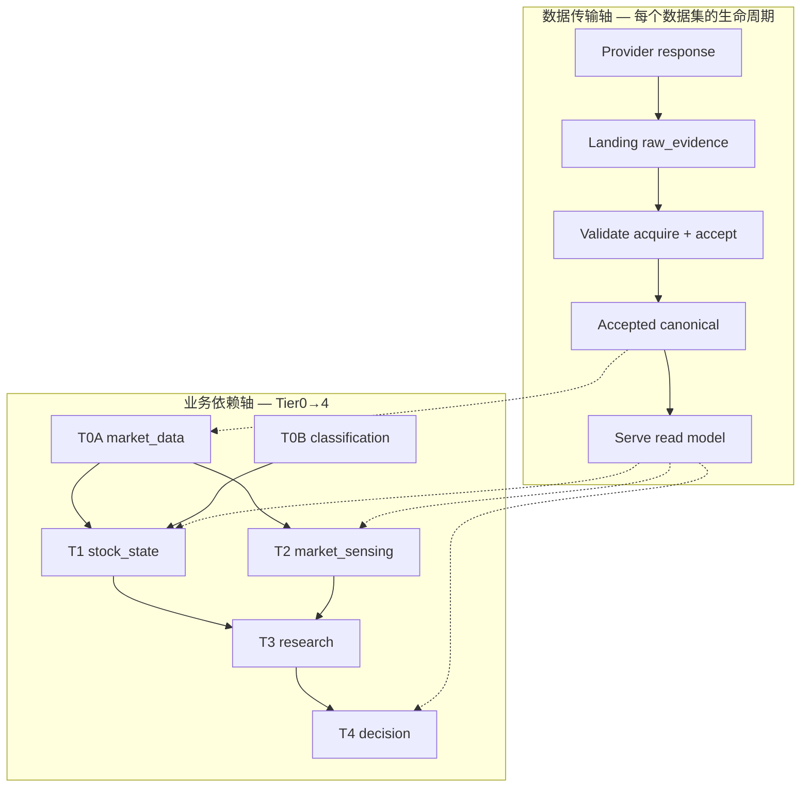

# DB 分层顶层设计（2026-07-21）

> **生命周期**：evidence-only / **DB 分层排序与物理边界权威**（由 `goal.md` 指针授权；不替代 `docs/MASTER_TOPLEVEL_DESIGN.md` 业务 Tier 立法）  
> **证据输入**：`plan_reeval_first_principles_20260720.md`、`data_foundation_modularity_gap_20260720.md`、`database_manifest.yaml`、`data_layers.yaml`、`legacy_raw_plane.yaml`  
> **禁令延续**：第二 DB  cargo cult、dual-write 迁移窗、plugin bus、按加工阶段机械拆库

---

## 0. 一句话裁决（专家义务，非迎合）

**逻辑上必须分层（与 MASTER transport 轴同构）；物理上不应按「raw / 初级加工 / 变量加工」各建一库。**

分层 = **语义生命周期 + 唯一 writer + 重建/保留策略**；拆 DuckDB 文件 = **写锁隔离、保留等级、blast radius**——二者正交。把「三层加工」映射成三个 `.duckdb`，会复现 2026-06 单体 smartmoney 锁争用，且制造 dual-write 诱惑（goal 禁令）。

当前物理布局 **大体正确、局部混放**；strangler 方向是 **收编语义边界 + 清 legacy 并行面**，不是 greenfield 五库重建。

---

## 1. 项目目的 → 「数据真相」必须支撑什么

ChunkyMonkey 的第一性目标（MASTER §1 + goal）不是「多抓表」，而是可审计的判断链：

| 消费者 | 需要的数据真相能力 | 失败后果 |
|---|---|---|
| **PIT 研究**（Tier3 B0→B5） | 冻结 `DatasetSnapshot`；决策时点 `available_at`；`project_universe_pit` population；名义成交价 ≠ qfq 分析面；输入带 definition/config hash | 泄漏 → 异常漂亮 → 真金白银误判 |
| **纸面执行**（Tier4） | 已发布 `StrategyRelease` 可追溯至 accepted + snapshot + 名义 exec 约束 | mock/qfq 成交价伪装生产能力 |
| **产品展示 / serve** | resolver 稳定读契约；scope 标签诚实（raw_evidence / external_aggregate / project_universe_pit）；research/unknown/stale/blocked/released 显式 | UI 完整感 ≠ 决策可用 |

因此「数据真相」最低集：

1. **供应商证据可重放**（landing / legacy raw，population=`raw_evidence`）
2. **项目接受事实不可静默改写**（accepted canonical + `accepted_partition` 原子链）
3. **派生可重建且带 lineage**（qfq/form/Tier1/2；改 config 可重跑，不改变历史 accepted）
4. **消费只经 resolver**（禁旁路直读；dual-track 已 NONE，须保持）

模块化 transport（S1–S6 FIXED）服务上述 (1)(2)，不是第五产品层——是 MASTER §3.1 的工程化。

---

## 2. 逻辑分层（命名清晰，对齐 MASTER，非新轴）

### 2.1 与 MASTER 两轴的关系

**逻辑层命名（中文 ↔ 英文 ↔ MASTER）**——覆盖 owner 问的 raw / 初级加工 / 变量加工，但不发明平行产品名：

| 逻辑层 ID | 中文 | 英文 | MASTER 对应 | 写入物 | 重建性 |
|---|---|---|---|---|---|
| **E0** | 证据层 | Evidence / Landing | transport: landing | `landing_*`、`ingest_batch`、legacy `raw_tushare_*` | 可 replay；legacy 镜像 permanent 直至 sunset |
| **E1** | 接受层 | Accepted canonical | transport: accepted | `canonical_*` + `accepted_partition` | 不可静默改写；扩 coverage 走 generation/parity |
| **D1** | 初级加工 | Primary derive | Tier0A 派生（qfq/form/segments） | `price_kline_qfq_*`、`fact_stock_form_daily`（Type A） | **from accepted** 可全量重建 |
| **D2** | 变量加工 | Variable compute | Tier1/2 发布 + Type B edge | `mart_*pulse*`、Tier12 publish rows、`feature_store` GT/inst | config/snapshot 变可重建；GT label 隔离 |
| **R1** | 服务投影 | Serve projection | transport: serve | DataAccess entity 指向的读面；router 零内联 SQL | 可重建；不得回写 E0/E1 |
| **I0** | 控制/血缘 | Control infra | Ops 观察，不拥有业务事实 | watermark、lineage、deletion_record、experiment verdict | runtime / 审计 |

**关键区分（盲 spot #1）**：

- **E0 ≠ 「项目 raw SSOT」**。Landing 是 `raw_evidence` scope，可含 BSE/非池对象（MASTER §5.1）。
- **E1 = 项目接受事实**。Universe/ST 过滤在 **population read**（`traded_on_observation_date`），不在 acquire exclude-then-fetch。
- **D1 vs D2**：不是「清洗 vs 特征」的主观分，而是 **Type A 确定性 PIT 重排** vs **Type B 含前瞻/label/score**（`data_layers.yaml` asset_class A/B）。D1 可进 SERVE；D2 默认 edge 隔离。

### 2.2 与 pipeline 四阶段的对照（不新建第五编排）

| pipeline 阶段 | 逻辑层 | 说明 |
|---|---|---|
| acquire | E0 | S4：`security_day_acquire` → landing only |
| （accept 在 sync 编排内） | E1 | S2：from-landing，零 provider |
| clean | D1 | qfq/form `--from-accepted`（S5 FIXED） |
| process | D1+D2 | form library、segments、market_pulse、Tier12 publish |
| store | I0 + 物理落库 | 治理表；不是业务 Tier |

`pipeline/run.py` 是 **caller-only 编排**（S3），不是新逻辑层。

---

## 3. 物理 DuckDB：现状 vs 目标（strangler）

### 3.1 现状映射（owner 清单 + manifest 扩展）

| 物理文件 | manifest alias | 今天实际承载 | 目标态角色 | 按层拆分？ |
|---|---|---|---|---|
| `data/tushare_raw.duckdb` | `tushare_raw` | legacy `raw_tushare_*` + formal landing/canonical/accepted（daily/ST/margin/disclosure 部分）+ `ingest_batch` | **Tier0 证据 + 接受 主库**（写锁与 smartmoney 解耦） | **否** — 已因写锁决策独立；不再按 E0/E1 拆两文件 |
| `data/reference.duckdb` | `reference` | `dim_trading_calendar`、`dim_active_a_stock` | **Reference truth**（日历/身份缓存；consumer RO） | **保持独立** — 全库只读 attach、低 churn |
| `data/market.duckdb` | `market` | `price_kline_qfq_tushare` 等分析 K 线 | **D1 派生 store**（qfq ≠ 成交价真相） | **保持独立** — 全量 rebuild 面，避免污染 E1 |
| `data/smartmoney.duckdb` | `smartmoney` | control plane（watermark/lineage/deletion）+ display marts（pulse/form）+ paper 观察 + 部分 disclosure canonical | **I0 + D1/D2 serve 混合**（历史债） | **不拆库** — strangler **表/contract 级**收编；新域不落 smartmoney 单体膨胀 |
| `data/feature_store.duckdb` | `feature_store` | inst episode/profile、rally GT/negative/strata | **D2 Type B edge**（重建able） | **保持独立** — 2026-06-28 U1 清空后专责 edge |
| `data/experiment_store.duckdb` | `experiment_store` | verdict、IC scan、pit audit | **I0 研究证据**（非 daily_update） | **保持独立** |
| `data/archive/`（parquet） | （非 DB） | 物删表 parquet 留底 | **保留等级 = 可逆删除证据** | **不是第七个 DuckDB** |

注：inventory 中「archive」= 目录 + parquet，**非**在线 DuckDB；禁止为 archive 再建 `.duckdb`。

### 3.2 为何不是「一层一库」

| 若按加工阶段拆库 | 实际代价 | 裁决 |
|---|---|---|
| raw.duckdb / primary.duckdb / feature.duckdb | accept 事务跨库；landing→canonical 非原子；ATTACH 链变长；agent  temptation 做 dual-write 同步 | **禁止**（goal 禁令「第二 DB」含此 cargo cult） |
| 维持现状 + 语义 contract | S1–S6 已证 caller-only；manifest 已路由 | **采纳** |
| 仅当 **写锁/保留/owner** 冲突 | 2026-06-11 已从 smartmoney 拆出 tushare_raw | **唯一合法拆库理由** |

### 3.3 Dual-plane 现状（S7 residual）

| 平面 | 表前缀 | 逻辑层 | 目标 |
|---|---|---|---|
| **Formal** | `landing_tushare_*` → `canonical_*` → `accepted_partition` | E0→E1 | 扩 coverage；daily 已 `20190102`→`20260720` |
| **Legacy** | `raw_tushare_*`（inventory **41/46 ssot**） | E0 兼容 | 逐域 **formal \| sunset**（S7）；禁盲删 |
| **NONCONFORMING** | miaoxiang 直写 fact（E0 PARTIAL） | 绕过 E0/E1 | R0 E0 迁入 transport |

**禁止**：formal 与 legacy 并行 ssot 的 **dual-write 迁移窗**——只允许 shadow/parity 后 **原子 cutover** 或 **显式 sunset**。

---

## 4. 专项问答

### 4.1 raw vs 初级加工 vs 变量加工 — yes/no/how

| 问题 | 裁决 |
|---|---|
| 逻辑上要分吗？ | **Yes** — 对应 E0 / D1 / D2；与 acquire / derive / Tier1/2 compute 边界一致（S1–S6 已 shipped） |
| 物理上要各一库吗？ | **No** — 见 §3.2 |
| 如何落地？ | **Contract + writer + manifest 路由**；derive CLI 与 accept 事务分离（S5）；Type B 进 `feature_store` |

### 4.2 ST / universe 过滤坐在哪

| 阶段 | 做什么 | 不做什么 |
|---|---|---|
| **Acquire**（formal daily/ST） | 全市场 by `trade_date` → landing（`raw_evidence`） | exclude-then-fetch；ST 黑名单；BSE 预删 |
| **Accept** | schema/grain/partition/completeness；population scope 声明 | 静默丢行洗成 valid |
| **Universe read** | `traded_on_observation_date` = calendar ∩ nominal K ∩ venue/board ∩ **当日 ST membership** | 用 vendor 返回全集冒充项目池 |
| **D1/D2 compute** | 消费 **immutable universe policy snapshot** + hash 入证据 | 内联白名单 |
| **Serve** | resolver 返回 scope 标签；external_aggregate ≠ project_universe_pit | 页面内第二套口径 |

ST 是 **E1 日级 membership 证据**（`stock_st` accepted partition），不是 acquire 排除项（MASTER §5.1 / goal 已裁决）。

### 4.3 Acquire 校验 vs Process 校验

| 校验类 | 时机 | 验证对象 | 失败域 |
|---|---|---|---|
| **Acquire / transport 校验** | landing 后、canonical 前（accept 路径） | 分片完整、schema、grain、future partition、contract compatibility | 隔离 provider/landing；**不触发重拉**（S2） |
| **Accept 校验** | `stage→validate→publish→accepted_partition` | canonical 行级 PIT、population proof、parity（迁移时） | kill-point；watermark 从 accepted 投影 |
| **Process / derive 校验** | D1/D2 重跑 | 输入 accepted snapshot、config hash、eligible universe | 可重跑；**不回写** E1 |
| **Serve 校验** | 读路径 | `available_at`、resolver trust、UNTRUSTED 拒绝 | 只读；fail-closed |

**盲 spot #2**：不要把 derive 失败当成 accept 失败去重拉 provider——这正是 S1–S3 拆分的目的。

---

## 5. 盲点清单（mio + 第一原理 + 奥卡姆）

### 5.1 一文件 vs 多文件

- **奥卡姆默认**：能 contract 约束就不拆文件。
- **拆文件触发器**（任一满足即可）：(a) 写锁争用（sync vs mart rebuild）；(b) 保留等级冲突（permanent evidence vs wipeable L2）；(c) 独立 owner 生命周期（experiment vs daily_update）。
- **反模式**：「看起来层次多」→ 多库；「legacy 表多」→ 新库逃避 sunset。

### 5.2 重建性（retention_class）

| retention_class | 代表库/表 | 策略 |
|---|---|---|
| permanent / canonical_source_store | tushare_raw formal、reference calendar | 删 = 物删流程 + parquet archive + deletion_record |
| rebuildable_feature_store | feature_store、market qfq | 可从 E1+D1 config 重建；重建须留 manifest |
| transient_experiment | experiment_store | 可 wipe；知识在 verdict JSON + config |
| governed_control_plane | smartmoney infra 表 | 投影 accepted；非第二套 writer |

### 5.3 Archive 角色

- **`data/archive/**`**：物删可逆证据（parquet），**离线**，不参与 serve/resolver。
- **不是** landing 冷存储、不是第二 raw 库。
- 正式 retention 真相：`mart_data_deletion_record` + ledger；archive 只是保险丝。

### 5.4 Lineage / 「路由表」— owner 问的该有什么

**不要新建一张万能「路由表」**——已有四件套，缺的是 **一致性收编**，不是第五张表：

| 机制 | 职责 | 现状 |
|---|---|---|
| `database_manifest.yaml` | 物理库 alias → path、domain、retention | **权威** |
| `data_access.yaml` entities | SERVE 桶：entity → db.table + PIT 锚 | **权威**（水龙头语义 partial：formal acquire 仍 hard bind tushare） |
| `sync_registry.yaml` | 数据集 writer、target_db、freshness | **权威**（与 manifest 对齐） |
| `accepted_partition` + `ingest_batch` | 接受代际、batch lineage | **权威**（infra，在 tushare_raw） |
| `mart_lineage` / `services/lineage/` | 依赖投影、impact 审计 | 生成/维护；**不**承担 runtime 路由 |
| `legacy_raw_plane.yaml` | S7 ssot/fill/sunset 清单 | 过渡；逐域清空后退役 |

**目标态**：consumer 只认 **DataAccess entity + resolver**；换源 = 改 entity 指针 + parity，不是改「路由表」一行万能字段。

### 5.5 其他易忽视点

1. **qfq 在 market 库** ≠ 成交价真相；纸面必须用 nominal（MASTER §6.1）。
2. **smartmoney 混 I0+D1 display** 是历史债；新 Tier1/2 发布走 contract/hash，不以此为借口拆库。
3. **membership L0**：SW `index_member_all` 已 strangler 到 `v_sw_industry_pit`
  （raw=compat）；**dc_member 仍 raw ssot** — S7 续刀；与 DB 分层正交。
4. **BOARD 非执法**；DB 边界以 manifest + 本设计 + goal 为准。

---

## 6. Strangler 下一刀（有序，docs+goal 本 turn；代码按需）

与 `plan_reeval` S7/E0 对齐，**不新开平行 program**：

| 序 | 切片 | 内容 | 退出条件 | 禁做 |
|---:|---|---|---|---|
| **D8-1** | 路由收编文档化 | manifest ↔ sync_registry ↔ data_access 三角 **单页真相**（本文件 + FEATURE_MAP 生成校验） | drift gate 零 dangling db alias | 新「路由表」表 |
| **D8-2** | S7 续 — membership L0 | SW index_member → PIT view **done**；dc_member 仍 **formal \| sunset** | inventory ssot 再降；moth green | 盲删 raw |
| **D8-3** | S7 续 — legacy raw 域 | 按 `legacy_raw_plane.yaml` 逐域 parity → cutover 或 sunset | 单域零 ssot 或显式 fill 文档 | dual-write 窗 |
| **D8-4** | E0 residual | disclosure provider land（非仅 local-raw）；org full-universe | NONCONFORMING 路径隔离 | silent merge |
| **D8-5** | market qfq lineage | placeholder batch_id 补齐或读面标 UNTRUSTED 至 derive 证据完整 | qfq 重建 manifest 可审计 | qfq 当 exec 价 |
| **D8-6** | （可选）smartmoney 表 tax | display vs infra 在 **data_layers** 声明 audit-only；无物理迁库 | doctor 可报告混层表清单 | smartmoney 拆库 |

**明确不做**：

- 新建 raw/primary/variable 三库
- 按 Tier1/2/3 各建 DuckDB
- archive 升格为在线 DB
- Optuna / StrategyRelease / cutover 回翻

---

## 7. 与现有 owner 文档关系

| 文档 | 关系 |
|---|---|
| `docs/MASTER_TOPLEVEL_DESIGN.md` | 业务 Tier + transport 轴 **立法**；本文件是其 DB 物理化附录 |
| `analysis/plan_reeval_first_principles_20260720.md` | Transport strangler S1–S7 **排序**；本文件不重复 S 切片细节 |
| `backend/config/database_manifest.yaml` | 物理库 **执行真相**；drift 时以 manifest 为准改本文件叙述 |
| `backend/config/data_layers.yaml` | 物理表 asset_class（A/B/raw/infra）；目标迁入 module contract 后瘦化 |
| `goal.md` | 指针本文件为 **DB 分层 authority** |

---

## 8. Verdict 标签

**APPROVED（逻辑分层）+ REJECT（按加工阶段拆库）+ STRANGLER（物理边界维持 manifest，清 legacy 并行面）**

Owner 口语「raw + 路由 + 加工 + 展示 API」= MASTER transport + resolver，**不是**新 fifth product。DB 管理要做的，是把 **已有四件套路由** 与 **E0→E1→D1→D2→R1 语义** 对齐，并在 S7/E0 把 **唯一 writer** 收到 formal 链上——而不是再数一次 DuckDB 文件。
