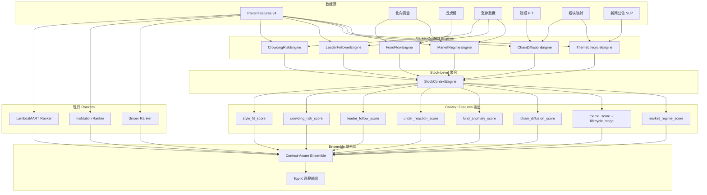

# Market Regime Framework — 市场状态理解系统设计文档

**Date**: 2026-05-19
**Scope**: 设计文档 (design only, 不含 code 实施)
**Owner**: ChunkyMonkey v4+ Roadmap
**Status**: Draft v1 — 框架定稿, 待 phase-by-phase 实施

---

## 1. 总览 (Vision)

### 1.1 核心理念

现行 ChunkyMonkey 选股链路 (sniper / institution / lambdamart) 本质是 **孤立个股打分**:
每只股票根据自身 panel features (动量, 反转, 量价, 机构持仓, 龙虎榜) 输出一个 score, ranking 取 top-K.

**问题**: 个股不是孤立的, 它存在于:
- 市场结构 (risk_on/risk_off, 流动性松紧, 风格偏好)
- 情绪周期 (启动/扩散/高潮/退潮)
- 主题生命周期 (新主题/主线/支线/退潮)
- 产业链位置 (上游材料/中游设备/下游应用)
- 资金路径 (主力流入/北向流出/游资接力)

同样的 panel features 在 risk_on 主升浪 vs risk_off 退潮期, 真实 alpha 差异巨大 (>3x).
**Vision**: 在 panel-level ranker 之上加一层 **市场理解层 (Market Context Layer)**, 输出 context features, 作为 ensemble 权重的 modulator.

### 1.2 一句话总结

> 不是判断"这只股票好不好", 而是判断"现在这个市场环境下, 哪种类型的股票好, 这只股票是否符合当前市场偏好".

### 1.3 输出契约

最终给量化模型的不是"买/不买"信号, 而是一组 **context features**:

| Feature | 含义 | 用途 |
|---|---|---|
| `market_regime_score` | -1 (risk_off) ~ +1 (risk_on) | ensemble 权重调节 |
| `theme_score` | 个股所属主题强度 0~1 | 加权 boost / penalize |
| `theme_lifecycle_stage` | 启动/扩散/高潮/退潮 (categorical) | 阶段化策略选择 |
| `chain_diffusion_score` | 产业链扩散方向 (上游→下游 或反向) | 龙头/跟随定位 |
| `fund_anomaly_score` | 资金异动强度 0~1 | 关注度信号 |
| `under_reaction_score` | 反应不充分程度 (信息已出但价未到位) | 滞后买入机会 |
| `leader_follow_score` | 龙头/跟随/独立 (categorical + 强度) | 节奏判断 |
| `crowding_risk_score` | 拥挤风险 0~1 | 高分时降仓位 |
| `style_fit_score` | 当前市场风格契合度 -1~+1 | 风格漂移规避 |

这些 features 喂给现行 sniper / institution / lambdamart 的 **ensemble 融合层**, 不直接出信号.

---

## 2. 七大引擎设计 (7 Engines)

### 2.1 MarketRegimeEngine — 市场情绪温度计

**Purpose**: 输出全市场宏观状态分类 (risk_on / neutral / risk_off), 解决"现在能不能加仓"问题.

**Inputs**:
- 全市场涨跌家数 (advance/decline ratio)
- 涨停/跌停家数比 (limit_up_count / limit_down_count)
- 连板梯队结构 (1板/2板/3板+ 家数, 高度梯队)
- 涨停封板率 (open_limit_count / total_limit_count)
- 主流指数 (沪深300 / 中证500 / 中证1000 / 创业板) 涨跌幅 & 量能
- 北向资金净流入
- 融资余额变化
- 全市场成交额, 换手率均值

**Outputs**:
- `regime_score`: -1.0 (深度 risk_off) ~ +1.0 (强 risk_on)
- `regime_label`: {strong_risk_on, risk_on, neutral, risk_off, strong_risk_off}
- `regime_confidence`: 0~1 状态稳定性
- `regime_days`: 当前状态已持续天数

**关键 features**:
- `breadth_5d`: 5 日涨跌家数 EMA
- `limit_up_quality`: 涨停封板率 × 连板高度
- `north_flow_5d_zscore`: 北向 5 日流入 z-score
- `index_dispersion`: 大小盘指数涨跌差 (风格信号)

**模型设计**: 规则 + GBDT 二阶段
- 规则层: 提取 12 个核心指标, 阈值映射到 5 状态
- GBDT 层: 用 labeled regime (人工标注或宏观事件) 训练分类器, 输出 confidence

**实施 ETA**: 2 周
- Week 1: features 抽取 + 规则层
- Week 2: GBDT 训练 + backtest 整合

**风险**:
- 状态切换滞后 (lag 1-3 days), 高频策略损失
- 北向数据 PIT (T+1 公布, 注意 alignment)
- 涨停数据需排除 ST / 次新 (定义噪音)

---

### 2.2 ThemeLifecycleEngine — 主题生命周期引擎

**Purpose**: 识别主题板块所处生命周期阶段, 解决"这个主题还能上车吗"问题.

**Inputs**:
- 板块 (申万二级 / 概念板块) 成分股 panel features 聚合
- 板块涨幅, 主力资金净流入
- 板块内涨停家数, 涨停梯队
- 板块换手率, 量能放大倍数
- 板块龙头股相对强度
- 主题新闻 / 公告 / 政策事件密度 (可选, NLP)

**Outputs**:
- `lifecycle_stage`: {dormant, ignition, confirmation, diffusion, climax, decay}
- `stage_progress`: 0~1 阶段内进度
- `stage_days`: 当前阶段持续天数
- `theme_strength`: 主题相对强度 (vs 全市场)

**关键 features**:
- `theme_momentum_3d/5d/10d`: 多窗口动量
- `theme_breadth`: 板块内 >5% 上涨家数比例
- `theme_leader_dispersion`: 龙头 vs 跟随相对强度差
- `theme_volume_amp`: 量能放大倍数 (vs 30d 均值)
- `theme_limit_up_density`: 涨停密度

**模型设计**: HMM (隐马尔可夫) + 启发式规则
- HMM 状态: 6 阶段, 转移矩阵从历史标注主题学习
- 启发式: 涨停密度峰值 + 量能背离 = 高潮信号

**实施 ETA**: 3 周
- Week 1: 板块映射 + features 抽取
- Week 2: HMM 模型训练
- Week 3: 启发式规则 + 主题分类 (申万 / 同花顺概念) 整合

**风险**:
- 主题边界定义模糊 (一只股可能属多主题)
- 概念板块成分股变动频繁, PIT 处理复杂
- 新主题冷启动 (无历史数据)

---

### 2.3 ChainDiffusionEngine — 产业链扩散引擎

**Purpose**: 追踪资金沿产业链上下游扩散路径, 解决"这只股票在产业链什么位置, 是否即将被点燃"问题.

**Inputs**:
- 产业链关系图谱 (上游材料 → 中游设备 → 下游应用 → 终端)
- 个股 / 板块涨跌幅时间序列
- 主力资金流入时间序列
- 业务暴露度 (主题纯度, 营收占比)

**Outputs**:
- `chain_position`: 上/中/下游 (categorical)
- `chain_diffusion_direction`: forward (上→下) / backward (下→上) / none
- `chain_diffusion_speed`: 扩散速度 (天/层)
- `next_in_chain_prob`: 个股是下一个被点燃的概率 0~1

**关键 features**:
- `upstream_strength_5d`: 上游板块 5 日强度
- `downstream_strength_5d`: 下游板块 5 日强度
- `chain_lag_days`: 个股 vs 龙头滞后天数
- `business_exposure`: 主题业务营收占比 (PIT, 来自财报)

**模型设计**: 图神经网络 (GNN) + 因果时序
- 节点: 个股 / 板块, 边: 产业链关系 + 业务相似度
- GNN 学习 diffusion pattern, 预测 next-to-fire 概率
- 简化版: 用产业链层级 + lag 模型

**实施 ETA**: 4 周
- Week 1: 产业链图谱构建 (静态映射)
- Week 2: 业务暴露 PIT 计算 (财报数据)
- Week 3: lag 模型 + diffusion 启发式
- Week 4: GNN (optional, 如有 GPU 资源)

**风险**:
- 产业链图谱质量决定上限 (需高质量第三方或人工)
- 跨主题股票归类困难
- GNN 训练数据量需求大

---

### 2.4 FundFlowEngine — 资金流引擎

**Purpose**: 识别主力 / 北向 / 游资资金异动, 解决"资金已动但价未动, 谁先知"问题.

**Inputs**:
- 个股 / 板块主力资金净流入 (大单 + 特大单)
- 北向资金持股变化 (Sina / EastMoney)
- 龙虎榜数据 (机构席位 / 知名游资席位)
- 融资融券余额变化
- 大宗交易, 协议转让数据

**Outputs**:
- `fund_anomaly_score`: 0~1 资金异动强度
- `fund_flow_divergence`: 资金/价格背离强度 (-1~+1)
- `smart_money_score`: 聪明钱跟踪信号 0~1
- `north_flow_persistence`: 北向连续流入天数

**关键 features**:
- `main_inflow_5d_zscore`: 主力 5 日流入 z-score
- `north_holding_change_5d`: 北向持股变化
- `lhb_inst_seat_count`: 龙虎榜机构席位次数 (30 日)
- `lhb_known_youzi_seat`: 知名游资席位识别 (规则 + 嵌入)
- `fund_price_divergence`: 资金流 / 价格相关性差

**模型设计**: 异常检测 (Isolation Forest) + 时序背离检测
- Isolation Forest 识别资金流异常
- 资金 vs 价格的 5 日相关性低 + 资金流强 = 背离信号

**实施 ETA**: 2 周
- Week 1: features 抽取 + 异常检测模型
- Week 2: 背离检测 + 龙虎榜席位识别

**风险**:
- 主力资金数据为推断值, 不同源差异大
- 龙虎榜 T+1 公布, 信号滞后
- 知名游资席位标签需持续维护

---

### 2.5 LeaderFollowerEngine — 龙头跟随引擎

**Purpose**: 识别主题龙头股和跟随股关系, 解决"谁是龙头, 龙头能带几个跟随, 跟随的最佳买点何时"问题.

**Inputs**:
- 板块 / 主题成分股涨跌幅时序
- 个股市值, 流通市值
- 涨停板时间, 封板时长
- 板块内相对强度排名
- 历史龙头标签 (人工 + 自动)

**Outputs**:
- `is_leader`: 0/1 是否板块龙头
- `leader_strength`: 龙头强度 0~1
- `follower_score`: 跟随股质量评分 0~1
- `leader_follow_lag`: 跟随股相对龙头的滞后天数

**关键 features**:
- `relative_strength_intra_theme`: 板块内相对强度排名
- `first_limit_up_time`: 当日首板时间 (越早越龙)
- `limit_up_seal_strength`: 封板强度 (封单 / 流通市值)
- `theme_consensus_rank`: 多日内板块强度排名稳定性

**模型设计**: 排名 + 网络分析
- 板块内每日相对强度排名
- Top 1-3 标记 leader, 稳定性 > 阈值 = 公认龙头
- 跟随股: 龙头涨停后 1-3 日跟涨的关联股票, 用相关性 + 业务相似度建图

**实施 ETA**: 3 周
- Week 1: 龙头识别规则 + 排名稳定性
- Week 2: 跟随股关联图谱构建
- Week 3: 滞后模型 + backtest

**风险**:
- 龙头切换频繁, 标签噪音大
- 跟随股定义需主题边界明确
- 新主题无历史可学

---

### 2.6 CrowdingRiskEngine — 拥挤风险引擎

**Purpose**: 识别交易拥挤 / 过热 / 反身性反转风险, 解决"何时该离场, 何时该警惕炸板"问题.

**Inputs**:
- 板块换手率, 量能放大倍数
- 涨停股开板率, 连板梯队断层
- 卖方研报覆盖密度 (可选, NLP)
- 散户搜索热度 (可选, 百度指数)
- 融资余额加速
- 板块拥挤度 z-score

**Outputs**:
- `crowding_risk_score`: 0~1 拥挤风险
- `reversal_risk_score`: 0~1 反身性反转概率
- `blowup_risk_score`: 0~1 炸板风险 (针对涨停股)
- `cooling_signal`: 0/1 退潮信号

**关键 features**:
- `turnover_zscore_30d`: 换手率 30 日 z-score
- `volume_amp_5d`: 5 日量能放大
- `limit_up_open_ratio`: 涨停开板率
- `consecutive_limit_breakdown`: 连板梯队断层数
- `north_outflow_persistence`: 北向连续流出天数

**模型设计**: 多因子 z-score 合成 + 阈值
- 标准化 5-8 个核心拥挤指标
- 等权 / IC 加权合成
- 历史回测确定阈值 (top 10% 拥挤区)

**实施 ETA**: 2 周
- Week 1: 拥挤指标抽取 + z-score 合成
- Week 2: 反身性 / 炸板专项模型

**风险**:
- 拥挤 ≠ 立即反转, 可持续高位运行
- 阈值需主题区分 (核心资产 vs 题材股)
- 假信号率较高, 需配合其他 engine

---

### 2.7 StockContextEngine — 个股上下文聚合引擎

**Purpose**: 把前 6 个引擎的输出聚合到个股粒度, 解决"这只股票当前市场上下文是什么"问题, 输出最终 context features.

**Inputs**:
- MarketRegimeEngine.regime_score
- ThemeLifecycleEngine (个股所属主题的 stage / strength)
- ChainDiffusionEngine.chain_position / next_in_chain_prob
- FundFlowEngine.fund_anomaly_score
- LeaderFollowerEngine.is_leader / follower_score
- CrowdingRiskEngine.crowding_risk_score
- 个股 panel features (现有 ChunkyMonkey v4)

**Outputs**:
- 个股 × 日 粒度 context feature dataframe
- 标准化 z-score / 归一化 0~1
- 缺失值填充策略 (中性默认值)

**关键 features**: 前述 9 个 context features (Section 1.3)

**模型设计**: 规则聚合 + 加权融合
- 个股 → 主题映射 (多对多, 取主题纯度最高的)
- 主题 features 下渗到个股
- 跨引擎 features 拼接, 不做模型, 仅特征工程

**实施 ETA**: 2 周
- Week 1: 主题映射 + features 下渗
- Week 2: 缺失值处理 + 输出标准化

**风险**:
- 多对多映射决定特征质量
- 缺失值处理影响模型稳定性
- features 之间多重共线性

---

## 3. 20 大研究方向 (Research Directions)

### 3.1 情绪周期 (Sentiment Cycle)
**Problem**: 市场情绪呈周期性波动, 不同周期阶段 alpha 来源不同.
**Features**: regime_score, breadth_5d, limit_up_quality, sentiment_phase
**Model 应用**: ensemble 权重模型, risk_on 主升期增加 momentum 因子权重, risk_off 增加 quality 因子权重.

### 3.2 主题生命周期 (Theme Lifecycle)
**Problem**: 主题板块从启动到退潮经历 6 阶段, 不同阶段策略不同.
**Features**: lifecycle_stage, stage_progress, theme_momentum_5d
**Model 应用**: 启动期买龙头, 扩散期买跟随, 高潮期减仓, 退潮期清仓.

### 3.3 龙头跟随 (Leader-Follower)
**Problem**: 板块龙头先行, 跟随股滞后 1-3 日.
**Features**: is_leader, follower_score, leader_follow_lag
**Model 应用**: 龙头加权 boost, 跟随股根据 lag 时间窗买入.

### 3.4 资金路径 (Fund Path)
**Problem**: 主力 / 北向 / 游资在不同股票间流转, 形成可追踪路径.
**Features**: main_inflow_5d_zscore, north_flow_persistence, lhb_inst_seat_count
**Model 应用**: 资金流入 + 价格未动 = under_reaction 机会.

### 3.5 反应不充分 (Under-Reaction)
**Problem**: 重大利好公告后, 市场反应慢 1-3 日, 存在 alpha.
**Features**: under_reaction_score, news_sentiment_lag, fund_price_divergence
**Model 应用**: 公告日 + 资金流入 + 价格未到位 = 高确定性买入.

### 3.6 风格轮动 (Style Rotation)
**Problem**: 大小盘 / 价值成长 / 周期消费风格轮动, 错风格 alpha 大幅衰减.
**Features**: style_fit_score, large_small_dispersion, value_growth_dispersion
**Model 应用**: 检测风格切换 + 调整选股偏好.

### 3.7 板块内部结构 (Sector Internal Structure)
**Problem**: 板块整体涨, 不代表所有成分股都涨, 内部分化决定 alpha.
**Features**: intra_sector_dispersion, sector_breadth, sector_concentration
**Model 应用**: 高分化期选龙头, 低分化期选跟随.

### 3.8 涨停生态 (Limit-Up Ecosystem)
**Problem**: 涨停股的连板梯队 / 接力路径 / 高度切换是市场情绪缩影.
**Features**: limit_up_seal_strength, consecutive_limit_max_height, limit_up_ladder_density
**Model 应用**: 梯队完整 = 健康, 断层 = 退潮信号.

### 3.9 人气拥挤 (Popularity Crowding)
**Problem**: 散户集中关注的股票存在反身性, 高拥挤区反转风险大.
**Features**: turnover_zscore_30d, retail_attention_score, crowding_risk_score
**Model 应用**: top 10% 拥挤股 penalize.

### 3.10 异动类型 (Anomaly Type Classification)
**Problem**: 异动有不同类型 (政策驱动 / 业绩驱动 / 题材跟风 / 资金驱动), 持续性不同.
**Features**: anomaly_type_label, anomaly_persistence_prob
**Model 应用**: 政策 / 业绩驱动加权, 跟风 / 资金驱动 penalize.

### 3.11 产业链冷启动 (Chain Cold-Start)
**Problem**: 新主题 / 新产业链无历史数据, 如何快速识别龙头.
**Features**: business_exposure, theme_purity, news_density
**Model 应用**: 用业务暴露度 + 信息密度做冷启动 ranking.

### 3.12 风险传导 (Risk Contagion)
**Problem**: 个股暴雷 / 板块暴跌通过产业链 / 龙头跟随关系传导.
**Features**: chain_risk_propagation, leader_breakdown_signal
**Model 应用**: 龙头跌停 → 全板块降仓.

### 3.13 业务暴露 / 主题纯度 (Business Exposure / Theme Purity)
**Problem**: 同一只股票可能属多主题, 业务暴露度决定真实主题归属.
**Features**: theme_purity_top1, theme_purity_distribution, business_exposure_revenue
**Model 应用**: 纯度高的票优先归类, 模糊的票降权.

### 3.14 板块共振 (Sector Resonance)
**Problem**: 多板块同步共振时, alpha 强度放大, 单板块独走 alpha 弱.
**Features**: sector_resonance_count, resonance_strength
**Model 应用**: 共振板块成分股加权.

### 3.15 主线 vs 支线 (Main vs Side Theme)
**Problem**: 主线主题持续 1-3 月, 支线 1-3 周, 仓位策略不同.
**Features**: theme_persistence_estimate, main_theme_indicator
**Model 应用**: 主线重仓, 支线轻仓快进快出.

### 3.16 市场宽度集中度 (Market Breadth Concentration)
**Problem**: 上涨家数集中在少数股票 vs 普涨, 市场结构不同.
**Features**: top_n_concentration, breadth_index, hhi_market
**Model 应用**: 集中度高 = 选龙头, 集中度低 = 普涨期可下沉.

### 3.17 反身性拥挤反转 (Reflexive Crowding Reversal)
**Problem**: 高拥挤股票存在自我强化 → 突然崩盘反身性.
**Features**: reflexive_risk_score, crowding_acceleration
**Model 应用**: 拥挤加速期严控仓位.

### 3.18 横截面相对强弱 (Cross-Sectional Relative Strength)
**Problem**: 个股相对全市场 / 板块的相对强度变化, 是 alpha 持续性信号.
**Features**: rs_market, rs_sector, rs_change_5d
**Model 应用**: RS 上升期持仓, RS 下降期清仓.

### 3.19 量价背离 (Volume-Price Divergence)
**Problem**: 价格新高但量能萎缩 = 顶部信号, 价格新低但量能放大 = 底部信号.
**Features**: volume_price_correlation, divergence_strength
**Model 应用**: 顶背离 penalize, 底背离 boost.

### 3.20 涨停接力路径 (Limit-Up Relay Path)
**Problem**: 涨停股之间存在接力关系, 接力路径可追踪.
**Features**: relay_partner_strength, relay_path_length
**Model 应用**: 在接力路径上的下一个候选加权.

---

## 4. 优先级路线图 (5 Phases Roadmap)

### Phase 1: MarketRegimeEngine (P1, Weeks 1-2)
**目标**: 给现行 ensemble 加一层全市场状态 modulator.
**交付**:
- `MarketRegimeEngine` 输出 `regime_score`, `regime_label`
- 集成到 sniper / institution / lambdamart ensemble 加权层
- backtest 验证 regime-aware ensemble vs 现状, 期望 ann_ret +5~10%

**风险**: 状态切换滞后, 用 ensemble 调节弱化影响.

### Phase 2: ThemeLifecycleEngine (P2, Weeks 3-5)
**目标**: 主题板块阶段化策略.
**交付**:
- 板块 → 个股映射表 (申万二级 + 同花顺概念)
- `lifecycle_stage` 分类输出
- 阶段化 alpha 验证 (启动/扩散期 alpha 显著高)

**风险**: 板块成分股 PIT 处理, 用 daily snapshot 解决.

### Phase 3: ChainDiffusionEngine + LeaderFollowerEngine (P3, Weeks 6-9)
**目标**: 产业链 + 龙头跟随联合建模.
**交付**:
- 产业链图谱 (上中下游)
- 龙头识别规则 + 跟随股关联图
- chain_diffusion_score + leader_follow_score

**风险**: 产业链质量决定上限, 用第三方数据 + 人工校对.

### Phase 4: FundFlowEngine (P4, Weeks 10-11)
**目标**: 资金异动 + 反应不充分捕获.
**交付**:
- fund_anomaly_score + under_reaction_score
- 龙虎榜席位识别 (机构 + 知名游资)
- 公告 + 资金 + 价格背离信号

**风险**: 资金数据源差异, 用多源融合.

### Phase 5: CrowdingRiskEngine + StockContextEngine (P5, Weeks 12-14)
**目标**: 风险控制 + features 聚合.
**交付**:
- crowding_risk_score 拥挤识别
- StockContextEngine 输出最终 9-feature context dataframe
- 完整 backtest: 加上下文 vs 现状

**风险**: features 多重共线性, 用 PCA / 正则化处理.

### 总 ETA: 14 周 (~3.5 月)
**Buffer**: +2-4 周用于联调, 总计 ~4 月落地全 7 engines.

---

## 5. 系统架构 (Architecture)



---

## 6. 跟现 ChunkyMonkey 集成方式

### 6.1 现状回顾

现行 ChunkyMonkey v3.2 / v4 链路:
- **Panel Features (123 cols, 93 useful)** → 三套 ranker (sniper / institution / lambdamart) → 各自 top-K → 简单融合 (等权或 IC 加权) → 最终 top-N

**痛点**:
- 三套 ranker 都是 panel-level, 看不到市场结构
- ensemble 权重静态 (固定 IC 加权), 无法跟随市场状态切换
- alpha 在 risk_on 时被低估, risk_off 时被高估 (drawdown 大)

### 6.2 集成方案

**改造点 1: Context-Aware Ensemble Weights**

现行 ensemble:
```
final_score = w_sniper * score_sniper + w_inst * score_inst + w_lmart * score_lmart
```
其中 `w_*` 是静态 IC 加权.

改造为:
```
w_sniper = base_w_sniper * f(market_regime_score, theme_lifecycle_stage)
w_inst = base_w_inst * g(market_regime_score, crowding_risk_score)
w_lmart = base_w_lmart * h(market_regime_score, style_fit_score)
```

例如:
- `risk_on + 启动期`: w_sniper boost (动量类有效)
- `risk_off + 高潮期`: w_inst boost (机构防御)
- `neutral + 退潮期`: w_lmart 主导 (综合判断)

**改造点 2: Context Features 作为 Ranker 输入**

把 9 个 context features 作为新 features 拼接到 panel features (123 + 9 = 132 cols), 重新训练 lambdamart, 期望 alpha 提升 5-10%.

**改造点 3: Crowding Filter (硬过滤)**

- top-K 选股后, 用 `crowding_risk_score > 0.8` 剔除 (硬过滤)
- 用 `theme_lifecycle_stage in {climax, decay}` 降权

**改造点 4: Theme-Aware Position Sizing**

仓位分配考虑主题集中度:
- 同主题持仓 ≤ 30%
- 单主题 stage == climax 时降权 50%

### 6.3 PIT 安全

所有 context features 必须 PIT 安全:
- regime_score 用 T-1 收盘后数据
- theme_lifecycle_stage 用 T-1 收盘后聚合
- 北向资金 T+1 公布, 实际可用 T+1 之后
- 龙虎榜 T+1 晚间公布, T+2 之后可用
- 财报数据用 ann_date + 1 天

参考 [[pit-audit]] skill, 任何 SQL JOIN 必须 `as_of_date ≤ T-1`.

### 6.4 实施路径

1. **Phase 1 落地**: MarketRegimeEngine + ensemble weights 改造点 1 (2 周)
2. **Phase 2 落地**: ThemeLifecycleEngine + 改造点 4 (3 周)
3. **Phase 3-5 落地**: 逐步加入剩余 engines, 每个 phase 都做 incremental backtest
4. **最终验证**: 完整 14 周后, 全量 backtest 对比现状 v3.2, 期望:
   - ann_ret +10-20% (从 45% → 55-65%)
   - max_drawdown -5-10% (从 -25% → -15-20%)
   - sharpe +0.3-0.5 (从 2.0 → 2.3-2.5)

---

## 7. 风险与开放问题

### 7.1 已知风险

1. **数据源依赖**: 北向 / 龙虎榜 / 板块映射来自第三方, 数据质量参差
2. **主题映射模糊**: 一只股属多主题, 主题边界不清晰
3. **PIT 复杂**: 多源数据 PIT alignment 容易踩坑 (参考 2026-05-15 inst_path_a leakage)
4. **过拟合**: 7 engines × 多 features 容易 overfitting, 需严格 walk-forward 验证
5. **计算成本**: GNN / HMM 计算量大, 可能需 GPU 资源
6. **解释性**: context features 黑盒, 影响策略可解释性

### 7.2 开放问题 (待 Codex 评估)

1. 板块映射用申万二级 (静态) vs 同花顺概念 (动态), 选哪个? 还是双轨?
2. ChainDiffusionEngine 用 GNN 还是规则? GNN ROI 如何?
3. CrowdingRiskEngine 阈值如何 calibration? 单一阈值 vs 主题分类阈值?
4. ensemble weights 改造用规则 (if-else) 还是 meta-learner (用 context 训练加权模型)?
5. context features 多重共线性如何处理? PCA / VIF / Lasso?
6. 与现有 P4 vol_sizing / 风控模块如何协同?

---

## 8. 附录

### 8.1 关联文档

- ChunkyMonkey 总览: `docs/msaf_top_design_20260517.md`
- v4 Panel 特征审计: `analysis/v4_panel_feature_audit_20260517.md`
- P1 Institution Baseline: `docs/msaf_p1_institution_baseline_20260518.md`
- P4 Vol Sizing 研究: `docs/msaf_p4_vol_sizing_research_20260518.md`
- First Principles 诊断: `analysis/first_principles_diagnosis_20260517.md`

### 8.2 关键反例索引

- 2026-05-15 inst_path_a latest snapshot leakage: 提醒所有 context features PIT 严格
- 2026-05-17 K 线 sync gap + holder 100% NULL: 提醒数据源 fallback 必须监控
- v3.2 P0a holder 路径 A 暂未接: 与 FundFlowEngine 机构席位识别有依赖关系

### 8.3 名词速查

| 术语 | 含义 |
|---|---|
| Regime | 市场宏观状态 (risk_on/off/neutral) |
| Theme Lifecycle | 主题板块从启动到退潮的 6 阶段 |
| Chain Diffusion | 产业链上下游资金扩散 |
| Leader-Follower | 板块龙头与跟随股关系 |
| Crowding | 交易拥挤度 (换手 + 量能 + 涨停密度) |
| Under-Reaction | 信息已出但价格未充分反应 |
| Context Features | 市场上下文特征 (本框架输出契约) |
| Ensemble Modulator | ensemble 权重调节器 (本框架用途) |
| PIT | Point-in-Time, 数据时点严格 |

---

## 9. 修订记录

| 日期 | 版本 | 修改 | 作者 |
|---|---|---|---|
| 2026-05-19 | v1.0 | 初稿, 框架定稿 | ChunkyMonkey |

---

**END of Document**
