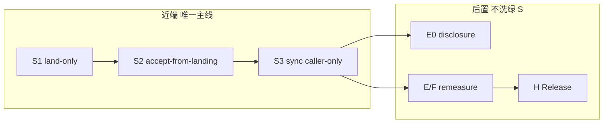

# 整体优化方案第一原理重评（2026-07-20）

> **生命周期**：evidence-only / sequencing authority（由 `goal.md` 指针授权近端排序；不拥有架构立法——仍以 `docs/README.md` owners 为准；`BOARD.md` 为生成投影非执法输入）  
> **证据包（事实，无裁决）**：`analysis/plan_reeval_evidence_pack_20260720.md`（commit `33d3a345f`）  
> **缺口诊断**：`analysis/data_foundation_modularity_gap_20260720.md`  
> **A→H 原文**：`~/.cursor/plans/gap_analysis_audit_3cdd0f6e.plan.md` §3–5  
> **不写**：Optuna / StrategyRelease / cutover 翻 / 第二 DB / plugin bus

---

## 0. 一句话裁决

**业主的「水龙头→raw+路由→加工→展示 API；一键 sync=编排器」在语义上正确，且与 MASTER transport 轴同构——但 daily/ST 运营路径仍未 shipped（`capture_and_publish_*` 焊死 fetch→land→accept）。**

**A→H 保留为后置研究地图与出口门清单，不再是近端主线。** 近端唯一合法序列 = **transport strangler S1→S3（必做，daily+ST+calendar 同焊点）→ S4–S6（按需）→ 再开 E0 闭合 / E/F 复测或 P2 换假设**。继续把 E/F remeasure 或 G/H 当「下一刀」= 在已闭合 protocol 上重复测量，且不触及 evidence pack §2.2 所述 **legacy `raw_tushare_*` 并行面**。

---

## 1. 第一原理：系统在证明什么

ChunkyMonkey 不是「多源 ETL 平台」也不是「策略工厂」。第一性目标（MASTER §1 + goal）：

1. **Tier0 真相可审计**：landing 保留供应商响应；accepted canonical 是项目接受的事实；population scope 与 availability 是正交硬轴。
2. **决策时点可见性**：`available_at` / PIT / universe policy 决定 consumer 能否读；不是 UI 装饰。
3. **策略可证伪**：同一 snapshot/universe/folds/costs 下消融；reject 是正式交付。
4. **真金白银门**：异常漂亮先查泄漏；无 `StrategyRelease` 不出候选。

**模块化诉求若只拆目录不拆调用边界，不增加任何上述可证伪能力。** 反之，**不模块化**会直接破坏 (1)(2)：无法 from-landing 重 accept、无法换源不重拉、失败时无法 kill-point 隔离 fetch vs validate。

---

## 2. Steel-man：业主的模块化叙事（最强版本）

| 业主说法 | 最强解读（不稀释） | 仓库已有近义（evidence pack §1） |
|---|---|---|
| 数据源 = 水龙头 | ProviderAdapter 只负责 request/response→landing schema；不在 landing 做 universe 业务过滤 | `data_access.yaml` L18–20「源=水龙头, entity=桶, SERVE=分水中转」；**但 formal daily sync 不经 entity 声明链** |
| raw store + routing/lineage | landing 表 + batch_id + observed_at + contract hash；canonical 单独 writer | 7 组 formal land/canonical（§2.1）；`services/lineage/` + `mart_lineage`；**无字面「路由表」** |
| 变量加工 | Tier1/2 compute + qfq/form 派生；只读 accepted（+ 授权 legacy 日落） | `pipeline/` 四阶段 docstring（获取/清洗/加工/存储）；L2 panel **wiped_20260628** |
| 展示 API | resolver / serve read model；禁止页面内第二套口径 | routers：`market_pulse`/`institution_profile`/`paper_portfolio`/`ops_manual_run`；dual-track residual=NONE |
| 一键 sync = 编排器 | `chunkyctl sync` / `daily_update` **只**按序调用独立模块；每步可单独重跑 | `pipeline/run.py` 已有 stage 编排；**formal daily/ST 绕开它**，直进 `sync_runner` 融合龙 |

**与历史「四地基」的关系（不等同、不否定）**：evidence pack §1.1 — repo 有「四地基 / 数据四地基 / M1–M3 采集·清洗·界面」审计措辞（20260703/20260708），**未见**「四大模块」正式枚举。业主本次 acquire/process/compute/display **语义上**覆盖 pipeline 四阶段 + MASTER transport，**不是**把 20260708 `READY_WITH_FIXES` 审计结论直接当作「编排已 shipped」。那次审计证的是 **floor（正确性/连续性）**，不是 **ceiling（运营可编排）**。

**业主澄清后的验收标准（唯一）**：运营级 **可独立调用的 acquire（→LANDED）与 accept（from-landing）**；编排器 **caller-only**。库内 `land_*`/`accept_*`/`publish_accepted_*` 可测 **≠** shipped——evidence pack §2.7；modularity gap §0–§3。

**已交付且不应回滚的 partial（勿与编排混淆）**：

- A/B-ext/B-pit/C 主路径 FIXED；`cutover_allowed=true`；frontier `20260720` current（evidence pack §3）
- formal land/canonical/`accepted_partition` 七域表名已存在（§2.1）；daily/ST **刻意不写** `raw_tushare_*` 镜像（§2.2）
- D FIXED；E measured reject；F0–F3 protocol-complete reject；E0 **PARTIAL**（§3 表）
- resolver 读面 dual-track residual=NONE

这些是 **正确性 + 研究 protocol 基建**，不是 **运营可编排模块化**，也不是 **legacy raw 面退役**。

---

## 3. 挑战：owner 可能低估的盲点

### 3.1 「raw SSOT」≠ landing 表名

- **landing** = 供应商事实证据（`raw_evidence` scope），可含 BSE/非池对象；**不是**「项目 raw 唯一真相」。
- **accepted canonical** = 项目接受事实；**serve** = 消费投影。
- 把「raw store」理解成一张万能 raw 表 → 会复现 legacy「前缀过滤冒充 universe」；population 必须 typed（`raw_evidence` / `external_aggregate` / `project_universe_pit`）。

### 3.2 Accept 不是「验收 cosmetics」

`stage→validate→canonical→accepted_partition` 是 **kill-point 原子链**（MASTER §6.1）。拆开 acquire/accept 的目的：

- accept 失败 **不再** 触发 provider 重拉（省钱、可复现、隔离失败域）
- watermark/continuity 从 accepted 投影，不是 parallel writer

若 modular 只做「land 单独 CLI」但 accept 仍内联 fetch → **需求仍未 shipped**。

### 3.3 PIT / `available_at` 与「模块化」同硬

- `manual` sync 可跳过 `same_day_at` 拉数，但 consumer **`available_at = max(observed, publication_cutoff)`** 不变（MASTER §3.1 transport sync authorization）。
- 模块化 **不能** 用「先落库再补 available_at」绕过；否则 Tier1/2/策略 consumer 会读到决策时点不可用数据 → **系统作废结论**（plan 死亡线 #1）。

### 3.4 Universe ≠ vendor dump

`traded_on_observation_date` = calendar ∩ 当日 nominal K ∩ venue/board ∩ 当日 ST——**不是** TuShare 返回全集。换源（S4）只换 adapter→landing；**canonical writer 与 universe resolver 不变**。过早做 S4 而不做 S2 → 换源仍要改 dragon。

### 3.5 可换源的真实成本

plan 已拍板「契约可换 adapter」，但：

- 2026-07-07 已物删未用多源 registry；live adapter = tushare（formal 域）
- miaoxiang 披露域 **NONCONFORMING**（直写 fact）→ **E0**，不是 S4 顺手修
- **第二源 silent merge、plugin bus、双写** = 明确禁止（goal 禁令 + MASTER §12）

**S4 应排在 S1–S3 之后**；否则「模块化」变成第二套 fallback 框架。

### 3.6 地基 without 消费者 vs 策略 without 地基

| 反模式 | 现状 |
|---|---|
| 无尽平台：S1–S6 全做完才允许任何研究 | **错**——D/E/F protocol 已 FIXED；reject 是证据 |
| 策略先行：E/F remeasure 当地基 | **已发生**——121d 窗全员 reject；不修复 transport 只重复测量 |
| 正确折中 | **S1–S3 闭合 transport 编排债** → 自然 sync 继续养窗 → **同一 protocol** 复测 E/F（不松门） |

**可证伪 consumer**：S3 完成后，用「from-landing 重 accept 不改 fetch 结果」对抗测 + `moth coupling` 证明 sync 生产 fan-in 不再经 `capture_and_publish_*`。

### 3.7 命名陷阱：「四大模块 / 四地基」≠ 新 Phase

evidence pack §1.1：**未找到**「四大模块」正式命名；「四地基」散见于 202607 审计与 purge 注释（M1 采集 / M2 清洗 / M2→M3 界面）。业主口语 acquire/process/compute/display ≈ pipeline 四阶段 + MASTER 两轴。**不要**再发明平行产品名或新总线——duplicate MASTER §3，且诱发 plugin/DAG（plan §10）。

**奥卡姆表述**：沿用已有 seam——`capture_security_day_provider_rows` → `land_*` → `accept_*`；`sync_runner` 瘦身为 caller。`pipeline/run.py` 继续管 derive 链；**不要**假意合并成第五套「四地基产品层」。

### 3.8 双平面 ingestion（evidence pack §2.2 — 业主常忽略）

| 平面 | 写入 | 消费者 |
|---|---|---|
| **Formal** | `landing_tushare_*` → `canonical_*` → `accepted_partition` | cutover resolver；qfq **部分**读 canonical |
| **Legacy** | `sync_registry` → `raw_tushare_*`（大量域） | 旧 mart / qfq UNION / 部分 pulse 路径 |

S1–S3 只解 **formal daily/ST/calendar** 融合龙（§2.7）。**不等于**「整个 repo 已模块化」。若 owner 期望一键 sync 管全部域 → **范围膨胀**，须显式拒绝或另开 residual 清单（margin 已 formal；披露 mix formal+NONCONFORMING）。

### 3.9 「水龙头」config 与 formal sync 脱节

`data_access.yaml` 声明「换源三步：新 adapter → 对账 → 改 db/table 指针；消费方零改动」。**实况**：formal daily `_adapter()` 硬绑 `LIVE_ADAPTER=tushare`；多源 registry 已物删（20260707）。**结论**：水龙头隐喻在 SERVE 声明链里 partial 成立，在 **Tier0 formal acquire** 里 **未 shipped**。S4 才是把它接上 landing 的正确位置——不是重写 `data_access` 指针 alone。

### 3.10 `daily_update` pipeline 已分层，但被 bypass

`pipeline/__init__.py`：preflight → acquire → clean → process → store（evidence pack §1.2）。**挑战**：这不是 greenfield——**缺的是 formal Tier0 域接入已有 stage 边界**，而非再写一套「四模块」。S3 应让 `sync_runner` daily/ST **调用** land/accept 模块；derive 继续走 `pipeline/clean.py` 等，避免第二个编排器。

### 3.11 BOARD 投影滞后（勿误读）

evidence pack §3：`BOARD.md` / `agent_context.json` 仍投影 `A→H next: F main_rally…` 等，与 `goal.md` 手写 **冲突**。**执法输入 = goal + 本文件**；BOARD 须 regenerate，不可当排序真相源。

---

## 4. A→H 方案重评：保留、降级、废弃

### 4.1 方案中仍值钱的（保留为附录/门清单）

| 块 | 保留理由 |
|---|---|
| 产品法 + 死亡线（plan §1） | 与 goal/MASTER 一致；裁决闸 |
| 积木五件套 + 两轴图（§2） | 架构 vocabulary；不重复立法 |
| 边做边测红→绿→窄回归（§5） | eng_gov + debug-delivery 已吸收 |
| Phase 出口门表（§5.3） | E0 披露 formal、H 仅 post-Release 仍有效 |
| 明确不做（§10 / MASTER §12） | 硬禁令来源 |

### 4.2 过度延伸或顺序错误（challenge + evidence pack §3）

| 项 | 问题 | 处置 |
|---|---|---|
| A→H 作为 **近端执行序** | A–D **FIXED**；E0 **PARTIAL**；E/F reject；G/H 未开（§3 表） | 降为 **Phase 地图 + residual 索引** |
| plan §8 差异表 | G2/G4 等多处 stale vs 现仓 | 以 evidence pack §3 + goal 硬事实为准 |
| 「机构跟随提前」作主线动力 | E `measured_reject_no_gain`；B4 inconclusive（§3） | 架构首包叙事保留；**执行后置** |
| forward_program P1 remeasure | 121d 窗 BLOCKED；与 S1–S3 竞争注意力 | **superseded** |
| 20260708 `READY_WITH_FIXES` / 四地基审计 | 证 floor 非 ceiling；**不含** land-only CLI | 不得用来洗绿 NOT SHIPPED |
| Phase A「唯一开工区」 | A 主 cutover 已闭合 | S1–S3 = A 内 transport strangler，并行不阻塞 |
| campaign vs product complete | forward_program §0 | 继续强制区分 |

### 4.3 Cargo-cult 相（警惕）

- **Phase 字母推进**本身不是进度；F3 reject 不是「该开 G」信号。
- **全量 backend 绿** ≠ Tier0 modular shipped。
- **文档写了分层** ≠ 运营可编排（本次 gap 诊断核心）。
- **institution_first 叙事** 若用来跳过 S1–S3 = 用策略优先级掩盖 transport 融合龙。

---

## 5. 奥卡姆修订程序（strangler，非 greenfield）

**不新建「四大模块」产品层。** 在 evidence pack §2.7 已证实的 fusion 域上收编 seam（**daily + stock_st + calendar** 均 `capture_and_publish_*`）：

```text
S1  land-only     : capture → LANDING only (≤40d / contract / eligibility)
S2  accept-only   : landing batch → validate → accepted_partition (零 _adapter)
S3  sync 瘦身     : sync_runner formal 域 = S1 → S2 → 既有 pipeline derive
--- S3 绿后再开 ---
S4  adapter 可换  : mock/本地 raw → 同一 landing 投影（接 data_access 水龙头语义）
S5  derive 入口   : qfq/form 独立 CLI；只读 accepted（legacy UNION 日落另账）
S6  serve 巩固    : lineage T2 已限 acquire+consume；router 仅 resolver
S7  legacy 清单   : raw_tushare_* 域逐项 formal 化或显式 sunset（**不在 S3 范围**）
```

**研究轨（后置，门不变）**：

```text
R0  E0 披露域 formal（miaoxiang → landing/accept）— 开 E 机构包前
R1  E/F 同 protocol 复测 — 仅当 S3 shipped + 自然窗扩大
R2  P2 换假设（单 block）— D1 全员 reject 路径
R3  G 公式 + BestChoice frozen challenger
R4  H Release/paper — 仅 accept + claimable
```



---

## 6. 切片退出条件（可证伪）

| 切片 | 退出条件（机器/对抗） | 禁止 |
|---:|---|---|
| **S1** | CLI/API：`land-only` daily\|stock_st 单日；**不写** canonical；LANDED batch 可查询；≤40d / forged contract / future partition 仍 fail-closed | 第二 DB；plugin bus |
| **S2** | CLI：`accept-from-landing --batch-id`；代码路径 **零** `_adapter`/`fetch_rows`；kill-point：accept 中断不触发 fetch | accept 内调 provider |
| **S3** | daily\|stock_st\|calendar：`chunkyctl sync` = S1→S2（+ derive）；`capture_and_publish_*` **非** sync 生产 fan-in（moth 可证） | sync_runner 内新焊龙 |
| **S4** | 假 adapter / fixture raw 喂 landing → S2 accept → canonical **不变**读契约 | 复活旧 fallback 框架 |
| **S5** | qfq/form 可 `--from-accepted` 重跑；不嵌入 accept 事务 | qfq 当成交价 |
| **S6** | dual-track residual 仍 NONE；新 router 审计 | 展示层回写 Tier0 |

**策略恢复门（全部满足才可把 E/F remeasure 升回「近端并行」）**：

1. S3 = **FIXED**（上表对抗测绿）
2. frontier 自然推进（禁 mass backfill；`operation_window_blocked` = 诚实）
3. 仍禁：Optuna、E 松门、StrategyRelease、G/H 抢跑

**E0** 与 S1–S3 **正交**：披露域 NONCONFORMING 不阻塞 daily/ST modular，但 **阻塞 E 机构包 production 叙事**。

---

## 7. 硬禁令（延续，不放宽）

- 静默 cutover / 回翻 `cutover_allowed=false`
- mass backfill；≤40d 授权窗外历史
- 第二 DB；plugin bus；通用 DAG
- Optuna；StrategyRelease；E edge gate 松门
- dual-write 迁移窗口；landing 写前 universe 丢行
- greenfield 重写借口（「残破感」≠ 许可证）
- agent 自降 commit tier

---

## 8. 与 evidence pack / artifact 对账

| 声称 | 判定 | 证据 |
|---|---|---|
| 「模块化编排已部分交付」 | **REJECT** | §2.7；无 land-only/accept-from-landing CLI |
| 「四地基 202607 已 READY → 编排 OK」 | **REJECT** | §1.2 A 段；审计 floor ≠ orchestration ceiling |
| 「水龙头 config = 换源已通」 | **REVISE** | §1.2 D + §3.9；formal `_adapter` 单源 |
| 「A 未完成不能动」 | **REVISE** | §3 表 A–C FIXED |
| 「F reject → 开 G」 | **REJECT** | §3 F/G/H 行 |
| 「E/F remeasure = 下一刀」 | **SUPERSEDED** | 本文件 |
| 「dual-track NONE」 | **KEEP** | goal 20260720 re-audit |
| 「披露已 land/canonical」 | **PARTIAL** | §2.1 三表存在；E0 ledger PARTIAL；miaoxiang 研究读面仍 NONCONFORMING |
| 「qfq 只读 canonical」 | **REJECT** | §2.2 UNION legacy raw |

Live 焊点（evidence pack §2.7 复核）：

```1863:1898:backend/services/data_sources/sync_runner.py
    """Fetch one trade_date and publish accepted nominal OHLCV or ST truth."""
    ...
    adapter = _adapter(str(spec["source"]))
    ...
        publish = lambda conn: capture_and_publish_authorized_nominal_ohlcv_partition(
            ...
            fetch_rows=_fetch_rows,
```

```69:84:backend/services/data_sources/nominal_ohlcv_runtime.py
    """Authorized canary/manual path: fetch → land → accept one trade_date."""
    ...
        batch = capture_security_day_provider_rows(...)
    ...
    return publish_accepted_nominal_ohlcv_partition(...)
```

---

## 9. Verdict：plan 如何 reposition

| 维度 | 裁决 |
|---|---|
| **gap_analysis_audit A→H** | 保留为 **产品法 + 研究 Phase 地图 + 测试门附录**；**不再**作为近端「下一刀」排序 |
| **forward_program E/F→G/H** | **历史 evidence**；P1 remeasure 让位于 **S1–S3** |
| **owner 模块化诉求** | **VALID & BLOCKING** — 与 MASTER transport 同构；**NOT SHIPPED** |
| **命名** | 不说「四大模块产品」；说 **transport strangler S1–S3** |
| **策略** | E/F 成果保留（诚实 reject）；**冻结为新假设/新窗前的 baseline** |

---

## 10. Owner 盲点 Top 7（专家义务 — 非迎合）

1. **表分开 ≠ 模块 shipped** — §2.7 fusion 龙；验收 = sync caller-only + moth fan-in。
2. **landing ≠ business SSOT** — §2.1–2.3；accepted + population scope 才是项目真相。
3. **低估 accept-from-landing** — 重验收不重拉；比「换 TuShare」更急。
4. **A→H 字母 ≠ 进度** — §3 表：E/F reject 不是开 G 信号；D/F protocol-complete ≠ 边缘成功。
5. **模块化 vs PIT 误对立** — §3.3；拆 seam 强化而非削弱 `available_at`。
6. **忽略 legacy `raw_tushare_*` 并行面** — §2.2 / §3.8；S3 绿只解 formal 三域，不自动「全 repo 模块化」。
7. **把 pipeline 四阶段当作「已编排」** — §3.10；formal daily **绕过** `pipeline/run.py` 直进 fusion——问题在 **接线** 不在 **缺模块**。

---

## 11. 近端 3 个 strangler 切片（立即顺序）

1. **S1 — land-only CLI**（daily + stock_st + **calendar**）：公开 `capture`+`land_*`；红例：不写 canonical；≤40d/forged contract 仍 fail-closed。
2. **S2 — accept-from-landing CLI**：`publish_accepted_*` 仅 `batch_id`；红例：accept 路径零 `_adapter`（evidence pack §2.7）。
3. **S3 — sync_runner 瘦身**：formal 三域改为 S1→S2；`capture_and_publish_*` 降为非生产或测试-only fan-in；parity 测 + moth coupling。

**S4–S6 / S7 不在 S3 前**（S7 = legacy `raw_tushare_*` 域清单，须单域 strangler，禁一锅端 greenfield）。

---

## 12. 文档指针

| 文档 | 角色 |
|---|---|
| `analysis/plan_reeval_evidence_pack_20260720.md` | 事实包（无裁决） |
| `analysis/data_foundation_modularity_gap_20260720.md` | NOT SHIPPED 验收语义 |
| `analysis/forward_program_efgh_20260720.md` | 历史附录（P1 superseded） |
| `~/.cursor/plans/gap_analysis_audit_3cdd0f6e.plan.md` | A→H 产品法 + Phase 门 |
| `goal.md` | 执行板；**本文件 = sequencing authority** |

**Label**：`REPOSITIONED` — formal transport strangler S1–S3 优先；A→H 后置；legacy raw 面与 E0 PARTIAL 单列 residual。

### Amend 2026-07-21 — S1+S2 shipped (PARTIAL)

- S1/S2 运营入口已落地（见 `goal.md` + modularity gap §8 + ledger）；live
  local-raw proof 扩 accepted daily/ST min→`20260115`。
- **S3 仍为近端唯一 blocking residual**（default sync fused）。
