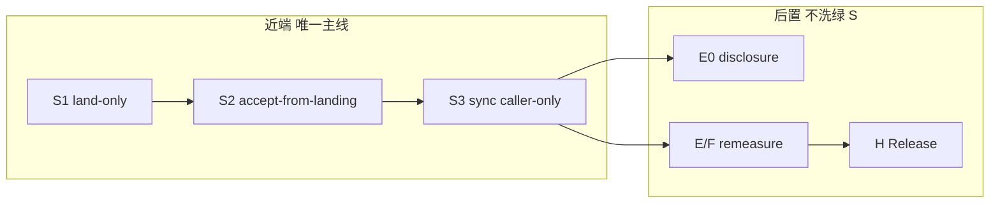

# 整体优化方案第一原理重评（2026-07-20）

> **生命周期**：evidence-only / sequencing authority（由 `goal.md` 指针授权近端排序；不拥有架构立法——仍以 `docs/README.md` owners 为准；`BOARD.md` 为生成投影非执法输入）  
> **方法**：Mio 代理义务（steel-man + 挑战盲点 + 奥卡姆 strangler）+ `gap_analysis_audit_3cdd0f6e` + live 证据  
> **证据**：`analysis/data_foundation_modularity_gap_20260720.md`；`goal.md` 已落地事实；`sync_runner`/`capture_and_publish_*`；`forward_program_efgh_20260720.md`；plan §3–5  
> **不写**：Optuna / StrategyRelease / cutover 翻 / 第二 DB / plugin bus

---

## 0. 一句话裁决

**业主的「水龙头→raw+路由→加工→展示 API；一键 sync=编排器」在语义上正确，且与 MASTER transport 轴同构——但 daily/ST 运营路径仍未 shipped（`capture_and_publish_*` 焊死 fetch→land→accept）。**

**A→H 保留为后置研究地图与出口门清单，不再是近端主线。** 近端唯一合法序列 = **transport strangler S1→S3（必做）→ S4–S6（按需）→ 再开 E0/E/F 复测或 P2 换假设**。继续把 E/F remeasure 或 G/H 当「下一刀」= 在已闭合 protocol 上重复测量，不修复 owner 指出的模块化债。

---

## 1. 第一原理：系统在证明什么

ChunkyMonkey 不是「多源 ETL 平台」也不是「策略工厂」。第一性目标（MASTER §1 + goal）：

1. **Tier0 真相可审计**：landing 保留供应商响应；accepted canonical 是项目接受的事实；population scope 与 availability 是正交硬轴。
2. **决策时点可见性**：`available_at` / PIT / universe policy 决定 consumer 能否读；不是 UI 装饰。
3. **策略可证伪**：同一 snapshot/universe/folds/costs 下消融；reject 是正式交付。
4. **真金白银门**：异常漂亮先查泄漏；无 `StrategyRelease` 不出候选。

**模块化诉求若只拆目录不拆调用边界，不增加任何上述可证伪能力。** 反之，**不模块化**会直接破坏 (1)(2)：无法 from-landing 重 accept、无法换源不重拉、失败时无法 kill-point 隔离 fetch vs validate。

---

## 2. Steel-man：业主的模块化叙事（最强版本）

| 业主说法 | 最强解读（不稀释） | 与 MASTER 对齐 |
|---|---|---|
| 数据源 = 水龙头 | ProviderAdapter 只负责 request/response→landing schema；不在 landing 做 universe 业务过滤 | §3.1 transport；§9 adapter 目标态 |
| raw store + routing/lineage | landing 表 + batch_id + observed_at + contract hash；canonical 单独 writer | landing ≠ canonical ≠ serve |
| 变量加工 | Tier1/2 compute + qfq/form 派生；只读 accepted（+ 授权 legacy 日落） | 业务轴 Tier1→2；qfq=派生非成交真相 |
| 展示 API | resolver / serve read model；禁止页面内第二套口径 | dual-track residual=NONE 方向 |
| 一键 sync = 编排器 | `chunkyctl sync` / `daily_update` **只**按序调用独立模块；每步可单独重跑 | §6.1 stage→validate→accept 原子链 |

**业主澄清后的验收标准（唯一）**：运营级 **可独立调用的 acquire（→LANDED）与 accept（from-landing）**；编排器 **caller-only**。函数文件已拆开 **≠** shipped——见 `data_foundation_modularity_gap` §0–§3。

**已交付且不应回滚的 partial（勿与编排混淆）**：

- C + B-pit `cutover_allowed=true`；frontier `20260720` current
- formal land/accept 函数与表分离（库内可测）
- D research_runtime FIXED；F0–F3 诚实 reject
- resolver 读面 dual-track residual=NONE

这些是 **正确性基建**，不是 **可编排模块化**。

---

## 3. 挑战：owner 可能低估的盲点

### 3.1 「raw SSOT」≠ landing 表名

- **landing** = 供应商事实证据（`raw_evidence` scope），可含 BSE/非池对象；**不是**「项目 raw 唯一真相」。
- **accepted canonical** = 项目接受事实；**serve** = 消费投影。
- 把「raw store」理解成一张万能 raw 表 → 会复现 legacy「前缀过滤冒充 universe」；population 必须 typed（`raw_evidence` / `external_aggregate` / `project_universe_pit`）。

### 3.2 Accept 不是「验收 cosmetics」

`stage→validate→canonical→accepted_partition` 是 **kill-point 原子链**（MASTER §6.1）。拆开 acquire/accept 的目的：

- accept 失败 **不再** 触发 provider 重拉（省钱、可复现、隔离失败域）
- watermark/continuity 从 accepted 投影，不是 parallel writer

若 modular 只做「land 单独 CLI」但 accept 仍内联 fetch → **需求仍未 shipped**。

### 3.3 PIT / `available_at` 与「模块化」同硬

- `manual` sync 可跳过 `same_day_at` 拉数，但 consumer **`available_at = max(observed, publication_cutoff)`** 不变（MASTER §3.1 transport sync authorization）。
- 模块化 **不能** 用「先落库再补 available_at」绕过；否则 Tier1/2/策略 consumer 会读到决策时点不可用数据 → **系统作废结论**（plan 死亡线 #1）。

### 3.4 Universe ≠ vendor dump

`traded_on_observation_date` = calendar ∩ 当日 nominal K ∩ venue/board ∩ 当日 ST——**不是** TuShare 返回全集。换源（S4）只换 adapter→landing；**canonical writer 与 universe resolver 不变**。过早做 S4 而不做 S2 → 换源仍要改 dragon。

### 3.5 可换源的真实成本

plan 已拍板「契约可换 adapter」，但：

- 2026-07-07 已物删未用多源 registry；live adapter = tushare（formal 域）
- miaoxiang 披露域 **NONCONFORMING**（直写 fact）→ **E0**，不是 S4 顺手修
- **第二源 silent merge、plugin bus、双写** = 明确禁止（goal 禁令 + MASTER §12）

**S4 应排在 S1–S3 之后**；否则「模块化」变成第二套 fallback 框架。

### 3.6 地基 without 消费者 vs 策略 without 地基

| 反模式 | 现状 |
|---|---|
| 无尽平台：S1–S6 全做完才允许任何研究 | **错**——D/E/F protocol 已 FIXED；reject 是证据 |
| 策略先行：E/F remeasure 当地基 | **已发生**——121d 窗全员 reject；不修复 transport 只重复测量 |
| 正确折中 | **S1–S3 闭合 transport 编排债** → 自然 sync 继续养窗 → **同一 protocol** 复测 E/F（不松门） |

** falsifiable consumer**：S3 完成后，应用「from-landing 重 accept 不改 fetch 结果」的对抗测证明模块化 **有 consumer**（continuity doctor + contract tests），不是架构 PPT。

### 3.7 「四大模块」命名陷阱

业主口语：acquire / process / compute / display ≈ MASTER 的 transport + Tier1/2 + serve。**不要**再发明平行产品名或新总线——那是 duplicate MASTER §3 两轴，且诱发 plugin/DAG 冲动（plan §10 明确不做）。

**奥卡姆表述**：沿用已有 seam——`capture_security_day_provider_rows` → `land_*` → `accept_*`；`sync_runner` 瘦身为 caller。

---

## 4. A→H 方案重评：保留、降级、废弃

### 4.1 方案中仍值钱的（保留为附录/门清单）

| 块 | 保留理由 |
|---|---|
| 产品法 + 死亡线（plan §1） | 与 goal/MASTER 一致；裁决闸 |
| 积木五件套 + 两轴图（§2） | 架构 vocabulary；不重复立法 |
| 边做边测红→绿→窄回归（§5） | eng_gov + debug-delivery 已吸收 |
| Phase 出口门表（§5.3） | E0 披露 formal、H 仅 post-Release 仍有效 |
| 明确不做（§10 / MASTER §12） | 硬禁令来源 |

### 4.2 过度延伸或顺序错误（challenge）

| 项 | 问题 | 处置 |
|---|---|---|
| A→H 作为 **近端执行序** | A/B/C/D 大量 **FIXED**；plan §8 差异表多处 stale（G2 resolver 已通、D runtime 已有） | 降为 **历史地图 + 未闭合 residual 索引** |
| 「机构跟随提前」作主线动力 | E/F 已测完 → reject；**不**产生 Release；不是 transport 债的解 | 保留 E 为首包 **架构叙事**，执行序 **后置** |
| forward_program P1「E/F remeasure 为唯一合法研究动作」 | 与 owner 2026-07-20 重评冲突；扩窗 BLOCKED（禁 mass backfill） | **降级附录**；见 `forward_program_efgh_20260720.md` 生命周期 |
| Phase A「当前唯一开工合法区」 | 过时；A 主路径已 cutover | 仅列 **A residual**（若有）并行 S1–S3，不阻塞 |
| 把 campaign protocol-complete 混为 product complete | forward_program §0 已分清 | 继续强制区分 |

### 4.3 Cargo-cult 相（警惕）

- **Phase 字母推进**本身不是进度；F3 reject 不是「该开 G」信号。
- **全量 backend 绿** ≠ Tier0 modular shipped。
- **文档写了分层** ≠ 运营可编排（本次 gap 诊断核心）。
- **institution_first 叙事** 若用来跳过 S1–S3 = 用策略优先级掩盖 transport 融合龙。

---

## 5. 奥卡姆修订程序（strangler，非 greenfield）

**不新建「四大模块」产品层。** 在现有 formal daily/ST 路径上收编三条 seam：

```text
S1  land-only     : capture → LANDING (≤40d / contract / eligibility)
S2  accept-only   : landing batch → validate → accepted_partition (禁止 _adapter)
S3  sync 瘦身     : sync_runner / daily_update = S1 → S2 → (现有 derive 调用)
--- 以下为按需，不阻塞 S3 验收 ---
S4  adapter 可换  : 本地 raw / mock / 第二源 → 同一 landing 投影
S5  derive 入口   : qfq / form enrich 独立 CLI，只读 accepted
S6  serve 巩固    : API/router 仅 resolver；失败不回写 landing
```

**研究轨（后置，门不变）**：

```text
R0  E0 披露域 formal（miaoxiang → landing/accept）— 开 E 机构包前
R1  E/F 同 protocol 复测 — 仅当 S3 shipped + 自然窗扩大
R2  P2 换假设（单 block）— D1 全员 reject 路径
R3  G 公式 + BestChoice frozen challenger
R4  H Release/paper — 仅 accept + claimable
```



---

## 6. 切片退出条件（可证伪）

| 切片 | 退出条件（机器/对抗） | 禁止 |
|---:|---|---|
| **S1** | CLI/API：`land-only` daily\|stock_st 单日；**不写** canonical；LANDED batch 可查询；≤40d / forged contract / future partition 仍 fail-closed | 第二 DB；plugin bus |
| **S2** | CLI：`accept-from-landing --batch-id`；代码路径 **零** `_adapter`/`fetch_rows`；kill-point：accept 中断不触发 fetch | accept 内调 provider |
| **S3** | `chunkyctl sync` 实现 = 顺序调用 S1→S2（+ 既有 derive）；`capture_and_publish_*` **不再是** sync 生产 fan-in；一键 UX 保留 | sync_runner 内新焊龙 |
| **S4** | 假 adapter / fixture raw 喂 landing → S2 accept → canonical **不变**读契约 | 复活旧 fallback 框架 |
| **S5** | qfq/form 可 `--from-accepted` 重跑；不嵌入 accept 事务 | qfq 当成交价 |
| **S6** | dual-track residual 仍 NONE；新 router 审计 | 展示层回写 Tier0 |

**策略恢复门（全部满足才可把 E/F remeasure 升回「近端并行」）**：

1. S3 = **FIXED**（上表对抗测绿）
2. frontier 自然推进（禁 mass backfill；`operation_window_blocked` = 诚实）
3. 仍禁：Optuna、E 松门、StrategyRelease、G/H 抢跑

**E0** 与 S1–S3 **正交**：披露域 NONCONFORMING 不阻塞 daily/ST modular，但 **阻塞 E 机构包 production 叙事**。

---

## 7. 硬禁令（延续，不放宽）

- 静默 cutover / 回翻 `cutover_allowed=false`
- mass backfill；≤40d 授权窗外历史
- 第二 DB；plugin bus；通用 DAG
- Optuna；StrategyRelease；E edge gate 松门
- dual-write 迁移窗口；landing 写前 universe 丢行
- greenfield 重写借口（「残破感」≠ 许可证）
- agent 自降 commit tier

---

## 8. 与现有 artifact 的对账

| 声称 | 判定 |
|---|---|
| 「模块化编排已部分交付」 | **REJECT** — land/accept 函数存在 ≠ 运营编排（gap §0） |
| 「A 未完成不能动 anything」 | **REVISE** — A 主 cutover 已闭合；S1–S3 是 A 内 **transport strangler**，非新 Phase |
| 「F reject → 该开 G」 | **REJECT** — forward_program §1.4；无 claimable |
| 「E/F remeasure 是唯一研究动作」 | **SUPERSEDED** — 本文件为 sequencing authority |
| 「dual-track 已 NONE」 | **KEEP** — S6 仅防回归 |

Live 焊点（复核）：

```1863:1898:backend/services/data_sources/sync_runner.py
    """Fetch one trade_date and publish accepted nominal OHLCV or ST truth."""
    ...
    adapter = _adapter(str(spec["source"]))
    ...
        publish = lambda conn: capture_and_publish_authorized_nominal_ohlcv_partition(
            ...
            fetch_rows=_fetch_rows,
```

```69:84:backend/services/data_sources/nominal_ohlcv_runtime.py
    """Authorized canary/manual path: fetch → land → accept one trade_date."""
    ...
        batch = capture_security_day_provider_rows(...)
    ...
    return publish_accepted_nominal_ohlcv_partition(...)
```

---

## 9. Verdict：plan 如何 reposition

| 维度 | 裁决 |
|---|---|
| **gap_analysis_audit A→H** | 保留为 **产品法 + 研究 Phase 地图 + 测试门附录**；**不再**作为近端「下一刀」排序 |
| **forward_program E/F→G/H** | **历史 evidence**；P1 remeasure 让位于 **S1–S3** |
| **owner 模块化诉求** | **VALID & BLOCKING** — 与 MASTER transport 同构；**NOT SHIPPED** |
| **命名** | 不说「四大模块产品」；说 **transport strangler S1–S3** |
| **策略** | E/F 成果保留（诚实 reject）；**冻结为新假设/新窗前的 baseline** |

---

## 10. Owner 盲点 Top 5（专家义务）

1. **把「表已分开」当成「模块已交付」** — 生产 fan-in 仍是 `capture_and_publish_*`；验收看 **sync 是否 caller-only**。
2. **把 landing 当 business SSOT** — landing 是证据；accepted + population scope 才是项目真相。
3. **低估 accept-from-landing 的运营价值** — 重验收不重拉、换源不重写龙、kill-point 隔离；这比「换 TuShare」更急。
4. **用 A→H Phase 字母当进度条** — D/F protocol-complete ≠ 边缘成功 ≠ transport shipped；121d 全员 reject 下继续 remeasure 是 **重复测量**，不是 **地基修复**。
5. **模块化 vs PIT 误对立** — 拆 seam 不削弱 `available_at`；融合龙才方便「先写库再补门」式泄漏。

---

## 11. 近端 3 个 strangler 切片（立即顺序）

1. **S1 — land-only CLI**（daily + stock_st）：`capture_security_day_provider_rows` + `land_*` 公开入口；红例：land-only 不写 canonical；forged contract / future partition 仍红。
2. **S2 — accept-from-landing CLI**：`publish_accepted_*` / `accept_*` 仅吃 batch_id；红例：grep/`moth coupling` 证明 accept 路径无 `_adapter`；accept 失败不触发 fetch。
3. **S3 — sync_runner 瘦身**：`_publish_security_day_accepted_partition` 改为 S1→S2 顺序调用；deprecate 生产路径对 `capture_and_publish_*` 的 fan-in；红例：一键 sync 行为 parity + 逐步可单独重跑 land/accept。

**S4–S6 不在 S3 前开工**（除非 S3 被 BLOCKED 且根因证明必须先 S4——当前无此证据）。

---

## 12. 文档指针

- 模块化缺口细节：`analysis/data_foundation_modularity_gap_20260720.md`
- A→H 原文：`~/.cursor/plans/gap_analysis_audit_3cdd0f6e.plan.md`
- 旧 forward 附录：`analysis/forward_program_efgh_20260720.md`
- 执行板：`goal.md`（本文件为 **sequencing authority**）

**Label**：`REPOSITIONED` — 地基 modular strangler 优先；A→H 后置；E/F reject baseline 保留。
