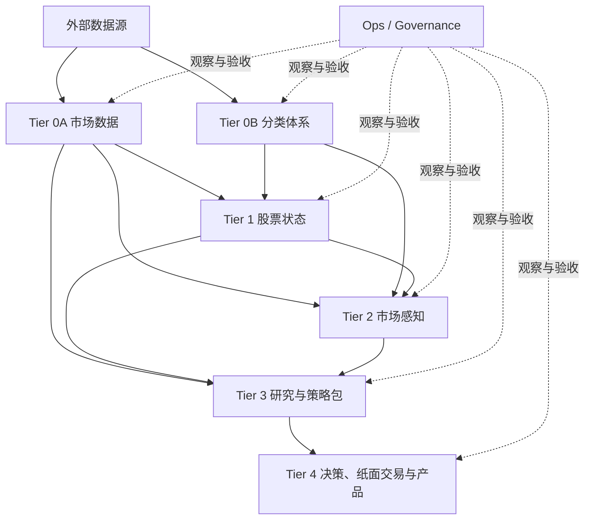

# ChunkyMonkey 顶层架构

> 状态：live
> 生效：2026-07-16
> 作用：项目目的、业务分层、模块边界和迁移顺序的唯一架构真相源。
> 当前状态与下一步只看 `goal.md`；工程执行规则看 `engineering_governance.md`；研究与发布规则看 `strategy_validation_contract.md`。

## 1. 项目目的

ChunkyMonkey 要把 A 股公开数据变成可审计、可复现、可执行的判断链：

1. 正确获取并加工交易与基础分类数据；
2. 描述股票当前阶段、形态和交易状态；
3. 描述市场资金活动、参与广度和价格响应；
4. 在统一数据快照上验证机构跟随、主升浪猎手和选股公式；
5. 只把通过 PIT、样本外和真实执行约束的研究结果发布为候选与纸面交易。

这不是“多抓数据、多建表、多跑公式”的项目。系统价值来自从原始证据到决策的完整闭环，以及每一步都能回答：数据从哪来、何时可知、谁加工、用的哪版规则、为何可信、失败时阻断谁。

## 2. 架构裁决

当前代码和数据资产可复用，但现有边界不可信。采用渐进式重构，不做大爆炸重写：

- 保留数据源适配、交易日历、K 线、技术状态、市场脉搏、机构画像和主升浪 ground truth 等有效资产；
- 冻结新增散表、散配置和旁路读取；
- 先建立契约、唯一 writer、版本和验收证据，再逐模块替换旧路径；
- 新旧路径 shadow-run 对账通过后才删除旧路径；
- 物理目录和数据库搬迁晚于语义边界，不以改文件夹制造“已解耦”的假象。

目标不是“零耦合”，而是依赖单向、耦合显式、失败可隔离、模块可替换。

## 3. 两条正交轴

### 3.1 数据传输轴

每个外部数据域都经过同一生命周期：

```text
provider response
  -> landing (原样保留，不做业务过滤)
  -> validate (schema/grain/partition/completeness)
  -> accepted canonical (标准身份、单位、时间和质量)
  -> serve/read model (面向消费者的稳定读契约)
```

`landing` 是供应商事实；`canonical` 是项目接受的事实；`serve` 是方便消费的投影。三者不能共用一个模糊的“raw/clean”名义，也不能在写 landing 前按股票池过滤。

### 3.2 业务依赖轴



高层可以依赖低层，低层禁止读取高层结果。Ops/Governance 观察各层并记录运行证据，但不拥有业务事实，也不能成为所有模块必须反向依赖的“超级层”。

## 4. 业务分层与唯一 owner

| 层 | 唯一职责 | 发布对象 | 不允许 |
|---|---|---|---|
| Tier 0A `market_data` | 日历、证券身份、名义 OHLCV、公司行动、复权因子、可交易规则、供应商资金字段 | `IngestBatch`、`AcceptedPartition`、canonical datasets | 在 landing 前按 universe 丢数据；用 qfq 代替成交价真相 |
| Tier 0B `classification` | 分类节点、父子关系、成员快照/有效期、跨体系映射 | `TaxonomyNode`、`SecurityMembership`、`TaxonomyCrosswalk` | 按名称把两套体系宣称为等价；把成员事实写进 YAML |
| Tier 1 `stock_state` | 截至决策时点的股票位置、趋势、纯度、量能、波动和形态事件 | `StockStateDaily`、`PatternEvent` | 未来收益、上涨概率、买卖信号；每个轴一张表 |
| Tier 2 `market_sensing` | 分类级/市场级的活跃度、方向性成交不平衡代理、参与广度、价格响应和版本化状态 | `SectorObservation`、`MarketContextSnapshot` | 把供应商“主力净流入”称为资金守恒流转；跨口径求和 |
| Tier 3 `research_runtime` + strategy packages | 冻结快照、基线、消融、PIT/OOS/成本验证、研究裁决 | `DatasetSnapshot`、`ExperimentRun`、`ExperimentVerdict`、`StrategySpec` | 每个策略自建实验框架；用展示 mart 直接做历史特征 |
| Tier 4 `decision` / `paper_execution` / `product` | 发布策略、生成候选、模拟订单成交、展示可追溯证据 | `StrategyRelease`、`DecisionBatch`、`CandidateSignal`、`PaperOrder/Fill/Nav` | 未发布实验直接变选股建议；用 qfq close 模拟真实成交 |

策略包只有三个：`institution_follow`、`main_rally`、`formulas`。它们共享研究和执行契约，不各建一套候选表、回测器或参数系统。

## 5. “积木”的完整定义

“模块 + 数据 + 配置”方向正确，但还缺契约和证据。一个可组合模块必须同时具备：

| 元素 | 内容 |
|---|---|
| Module | 纯逻辑、公开 API、唯一变化原因 |
| Data | 输入/输出 schema、grain、主键、PIT/availability、来源与版本 |
| Config | 可调整政策：阈值、窗口、源优先级、启停、资源限制 |
| Contract | module/version、输入输出、writer、消费者、失败传播、重建/退役规则 |
| Evidence | batch、accepted partition、config hash、测试、实验和发布裁决 |

模块内部文件不是独立积木。例如 `technical_states/axes.py`、`patterns.py`、`candles.py` 是 `stock_state` 的内部实现，不应各自拥有表、YAML 或跨模块 API。

### 5.1 数据集契约

任何跨模块发布数据集必须声明：

- `dataset_id`、owner 和唯一 writer；
- 精确 grain、主键和允许的重复语义；
- event/effective/observed/available/built 时间；
- publication availability 的显式 `axis/rule/at`；transport/batch mode 只负责如何枚举请求，
  不得隐式决定数据何时可用；
- 输入 snapshot、source batch、definition/config hash；
- population scope：`raw_evidence`、`external_aggregate` 或 `project_universe_pit`，以及同一次执行
  使用的 universe policy id/version/hash；
- schema、单位、NULL/unknown 语义；
- criticality、失败传播和允许的 fallback；
- 消费者、重建方式、retention 和退役条件。

缺少任一关键项，不得称为 canonical 或策略证据。

availability policy 必须经过类型校验并进入 contract/config hash。默认增量、显式历史回放和
drain 只能消费同一个 eligibility resolver：显式 future bound 或注入的未来 partition 必须在
provider adapter、目标 DB 和 writer I/O 前失败；历史回放上限只收窄本次操作窗口，不能覆盖真实
frontier 或控制面投影。一次 plan 只能从一个 registry snapshot 派生一个 immutable contract，
runner、writer、read model、projection、pipeline 与 audit 必须透传该对象，不能在下游重新读出
等值但不同代的配置。formal dataset 的 batch mode、date parameter、write mode、分片字段和全生命
周期 group 集合必须在运行副作用前证明与合同兼容；重复、非规范或缺失分片不能先集合化后洗掉。
裸 `t+1` 没有说明交易日/日历日/公告日等轴，只能作为未迁移 legacy 提示，不能跨域推广。

**Transport sync authorization ≠ consumer publication.** Typed `same_day_at`
(e.g. daily 18:00) remains the consumer/`available_at`/continuity clock.
Sync paths take an explicit `trigger_mode`:

- `manual` (chunkyctl / UI click / human-triggered): on an open calendar trading
  day, may fetch without waiting for `policy.at`; weekends/holidays and
  non-`same_day_at` session gates still bind; early capture stamps
  `available_at = max(observed_at, publication_cutoff)` so research consumers
  do not treat incomplete intraday bars as published before the contractual
  clock.
- `automatic` (future scheduled / no-human path): keeps the `same_day_at`
  clock gate unchanged.

population scope 与 availability 是正交的两条硬轴：交易日历回答“何时可用”，eligible universe
回答“哪些证券/市场可进入该发布对象”。landing 保存已请求的供应商原始响应，不执行业务过滤；
canonical/serve 必须消费一次加载的 immutable universe policy snapshot，并把 accepted/excluded 行数、
reason 与 policy hash 写入证据。三类 scope 不得混用：

- `raw_evidence` 只证明供应商实际返回了什么，可含 BSE、新老三板、ST、退市或非股票对象；
- `external_aggregate` 保留交易所/供应商定义的总体，必须明确 venue、population、method 和 unit，
  不能命名或宣传为项目股票池统计；交易所级一行无法证明其中每只证券都符合项目 universe；
- `project_universe_pit` 的当前正式日级定义是 `traded_on_observation_date`：accepted 交易日历证明 t 开市，
  accepted 名义日 K 线给出 t 日实际交易证券，再按合法 venue/board 白名单过滤为**沪深A（含 ST/*ST）**。
  停牌、已终止交易或尚未上市因 t 日无 K 线而排除；股票后来退市不得反向删除其过去实际交易日。
  **不**按 ST 名称或 `stock_st` 成员踢出池；B/BJ/新老三板/ETF 等由 board 白名单排除。
  “退市整理期仍交易也排除”是更强的 temporal-status 语义，只有新增 PIT 身份/status 真相源后才可声称。

**Formal acquire vs universe eligibility（owner 硬裁决）**：

1. Formal **daily / stock_st** acquire = **全市场按 `trade_date` 拉**（`batch_mode=by_trade_date` →
   `raw_evidence` landing）。**禁止** exclude-then-fetch：不得先用 ST/BSE/三板/退市名单裁股票池再请求。
2. **ST / `stock_st`**：accepted **日级 membership 证据**（谁在何时是 ST），供策略/展示 PIT 消费；
   **不是** universe denylist，也**不是** acquire 排除名单。沪深A 白名单**包含** ST/*ST。
   `stock_st` 同日 `zero_rows` / `pending_publish` = **域发布窗问题**，不得误读为「产品不要 ST」。
3. **BSE / 新老三板 / B股 / 同类非池对象**：landing **可以含**；经 `universe_rules` /
   population read（board include/exclude + eligibility）过滤进项目池——**不是** acquire blacklist。
4. **退市**：主路径是观察日 **无名义 K** → 当日 `traded_on_observation_date` 不合格；
   **不是** acquire 黑名单删历史。后来退市不得反向抹掉过去实际交易日。
5. **对比（非 formal 路径）**：部分 legacy `by_ts_code` / `by_code_list` 域可对代码清单预过滤后逐码请求——
   那是供应商接口形状或 legacy 成本路径，**不得** retroactively 定义 formal daily/ST 的 acquire 契约，
   也不得把「名单预筛」宣称为项目 universe 真相。

该日级门的 accepted 证据契约在实现前必须同时满足：calendar 使用不可变全量 generation 并从 contract
重算 t 的开放性与 cutoff；nominal Kline/ST 使用 t 日 accepted partition；三者由同一 read-only DB/
registry snapshot 的 trusted loader 读取并复算 canonical/projection hash、grain 唯一性、正向完整性和
availability。验证码/权限页、失败 envelope、任意自报 completeness、未来 observation、事后 backfill、
0 行以及 caller 自构造 ref 一律不能满足门。输出可用时间取三源 `max(available_at, accepted_at)`；配置的
include/exclude 前缀不得重叠。上述 proof/loader 未接通前，状态只能是 `NOT_EVALUATED/BLOCKED`。

transport completeness 只验证请求/响应分片，不能决定 publication population。正式 runner 必须在
calendar、writer lock、authorization、adapter 和 DB I/O 前拒绝静态 scope 矛盾，在 canonical/serve
发布前拒绝 row-level PIT 污染。同一执行只能从一个 registry snapshot 和一个 universe policy
snapshot 派生 contract；runner、writer、state、audit 与 consumer 禁止下游重载配置或自行内联白名单。

`coverage_start` 是当前 generation 承诺的完整覆盖义务，不是早期分区的 acceptance 禁区。历史
预迁移冻结 active contract/config hash，以 `AcceptedPartition` 的完整 lineage proof 加逐分区
`PARITY` 作为可复用 checkpoint；只有全地平线零 missing、零非 parity、零未决 landing 后，才可
原子提升 full-coverage generation。新 generation 若只扩 coverage，可以通过机器证明的精确
predecessor 关系消费旧 generation 证据，但旧 batch/pointer/canonical 的 version/hash 不得改写、
复制或重标；schema、grain、source、writer、availability、group completeness 等任一语义变化都
必须拒绝兼容继承。

formal 历史执行必须显式声明 start/end/单次分区上限，按最老缺口优先，并把 accepted+proof+
parity 分区从 provider 计划中剔除。仍由 legacy consumer 提供迁移参照时，provider candidate 必须
先与未改写 legacy 做 grain/NULL/数值全量比较；只有完全一致才允许发布 canonical，任何冲突保留
landing 证据、首错停批且禁止 legacy DML。全局 projection 继续诚实描述服务义务，本次窗口外
缺口与 cap deferred 不能冒充本批失败或成功。

### 5.2 何时落表

模块输出只有满足至少一项才持久化：

- 被多个模块复用；
- 重建成本高；
- 必须审计或复现；
- 是正式发布/决策结果。

单次计算、中间矩阵和消融明细优先使用 CTE、内存、临时表或带 manifest 的 artifact。禁止“一模块一表”“一版本一表”“一公式一表”。版本应是列或分区，而不是 `v2/v3` 表名。

### 5.3 配置边界

配置只保存稳定政策，不保存事实和运行状态。禁止写入 active config：

- watermark、last run、失败队列或验收结果；
- 尚不存在的 backend、模块、表和未来愿景；
- 分类节点、成员、历史观测；
- 任意代码拓扑、动态 import 或可执行 YAML DSL。

每个 active config 必须有类型校验；未知键、悬空引用和错误类型 fail closed。显式的 Python wiring 是允许的，依赖关系不必藏进通用 DAG 或插件系统。

### 5.4 运行结果的 typed 语义（`run_outcome`）

§5 的 Contract 一行要求每块积木声明**失败传播**。一次管线运行的失败传播语义由
typed `run_outcome` 承载，它是系统语义（运行时必须成立），不是开发纪律 —— 故 owner
在本文件，不在 `engineering_governance.md`。单一计算点 = `backend/services/pipeline/run_outcome.py`。

**四态，穷尽且互斥：**

| 态 | 含义 | 判据 | exit |
|---|---|---|---|
| `success` | 该做的都做了 | 无任何 degraded | 0 |
| `soft_waiting_clock` | 在等时钟，不是缺陷 | 只有**具名**软态（`pending_publish` / `pre_available_after_zero_rows` / `same_day_vendor_vacuum` / drain 残余缺口…） | 1 |
| `integrity_observe` | 真实的数据/派生洞，**不是**等时钟 | 有完整性类 degraded（continuity、residual_hygiene、system_health 自检…），**或**任何无法归类的 degraded | 1 |
| `hard_fail` | 现在就得处理，链路已断 | AUTH / PREFLIGHT / TIER0 / WRITER BLOCK | 2 writer · 3 auth · 4 preflight · 5 tier0 |

**四条不可放宽的规则：**

1. **归类不明 ≠ 等时钟。** 认不出的 degraded 归 `integrity_observe`，不是
   `soft_waiting_clock`。「等时钟」是需要被证明的具名状态，不是兜底桶 —— 反向兜底
   等于把未知问题渲染成「正常等待」。
2. **完整性 ≠ 时钟**（`serve_derive_closed_loop_law` 的裁决）：数据有洞和「今天数据
   还没发布」是两件事，不许合并成一个琥珀色。
3. **下游只渲染，不重新推断。** exit code、Script Editor wrapper、macOS 通知、
   workbench 一律读 `run_outcome` 字段；**禁止**从「rc != 0」反推 FAIL —— 软态与完整性
   观测的 rc 都是 1，按 rc 推断会把观测渲染成失败，把「日更红了」变成噪音。
4. **报告 JSON 是真相源，exit 是渲染器。** `data/reports/daily_*.json` 里的
   `run_outcome` / `run_outcome_label` / `run_outcome_reason` / `run_outcome_exit_code`
   / `run_outcome_classified` 才是对象；进程退出码只是它的一个投影。

**Rollup 顺序**（任一命中即定，不再下推）：任何 hard → `hard_fail`；否则有完整性或
不可归类 → `integrity_observe`；否则有具名软态 → `soft_waiting_clock`；否则 `success`。

消费面（改任一处都要回看本节）：`backend/services/pipeline/run.py`、
`backend/services/pipeline/store.py`、`backend/services/notification/dispatcher.py`、
`backend/routers/ops_manual_run.py`、`scripts/manual_job_wrapper.py`、
`frontend/src/api/ops.ts` + `frontend/src/pages/WorkbenchPage.tsx`。
本节与代码 enum 的一致性由 moth 断言 `run-outcome-four-states-law` 机械锁定。

### 5.5 变量积木分层（L0–L4）

传输轴（§3.1）说的是**一个数据集怎么走完生命周期**，业务轴（§3.2）说的是**谁能依赖谁**。
这一节说第三件事：**一个变量属于哪一层**。三者正交，不是同一把尺子换个说法。

| 层 | 是什么 | **不是**什么 | writer / 依赖 |
|---|---|---|---|
| **L0 证据** | 供应商响应原样 + `batch_id`/`observed_at`/contract hash | 项目 universe 真相；可回测特征；「干净 K 线」 | acquire/land 唯一 writer；population=`raw_evidence` |
| **L1 接受事实** | 项目接受的 canonical 行 + `accepted_partition` 代际证明 | qfq 分析视图；Tier1 状态；vendor 全集冒充池 | accept 模块唯一 writer，**零 provider 调用** |
| **L2 原语** | 从 L1**确定性**派生的基础变量，每条带 `available_at`/method/unit/denominator/coverage/definition hash | 含未来 label 的列；跨口径 conserved-money 求和；未声明 availability 的 mart 列 | **仅依赖 L1**（+ reference 维表）；禁读 L3/L4 |
| **L3 组合砖** | 版本化组合，lineage 完整（输入 brick id + config hash → 输出 schema） | 无限深度 ad-hoc SQL；策略 verdict；Optuna 搜索空间 | 可依赖 L2 或**一层** L3，**深度上限 2 hop** |
| **L4 策略产物** | 在**冻结** `DatasetSnapshot` 上产生的候选/信号/实验列，PIT 截断 0-diff | daily_update 的默认重算面；未发布 StrategyRelease 的生产输入 | 有 prereg/verdict 才持久化，否则用 CTE/artifact |

**依赖硬规则**（违反任一条即 fail-closed，不是风格建议）：

1. **偏序** `L4 → L3 → L2 → L1 → L0`；下层禁读上层；禁止成环。
2. 跨层发布必须带 §5.1 的最小契约集（dataset_id / grain / population scope /
   availability axis-rule-at / config hash / writer / consumers）。
3. L2 起每条变量必须有 `available_at` 决策时点语义；`manual` 早抓不改变 consumer 的
   `max(observed_at, publication_cutoff)`（§5.1）。
4. **同输入同 hash → 同输出**必须可证；hash 变则是新 brick 版本，**不静默覆盖**。
5. L3 的输入必须在 lineage 里可枚举；**缺 lineage = UNTRUSTED，不是「大概对」**。
6. 生产 derive/compute 默认 `from_accepted=True`；读 legacy raw 须显式逃生参数 +
   inventory 登记，**没有静默 UNION**。
7. **L3 深度上限 2 hop** —— 这是「禁止无限变量 DAG」的可执行形式：链越深，泄漏越不可审计。

**明确禁止的反模式**（每条都对应一次真实代价）：无限变量 DAG（泄漏不可审计）·
每模块一表 / 每公式一表（表爆炸）· plugin bus 或通用 DAG（YAML 图编程、隐式依赖）·
dual-write 迁移窗（两平面 ssot 漂移；正解是 shadow parity → **原子 cutover** 或 sunset）·
serve 回写 Tier0（dual-track 复活）· 「残破感 → 重写」（丢掉 cutover 与 measured reject 的证据）。

### 5.6 物理数据库分层：为什么不按层拆库

逻辑分层（§5.5）与物理文件是**两件事**。按加工阶段拆成 `raw.duckdb` / `primary.duckdb` /
`feature.duckdb` 看似整齐，实际代价是：**accept 事务跨库** → `landing→canonical` 不再原子；
ATTACH 链变长；并且给「dual-write 同步两库」制造了理由 —— 那正是 `goal.md` 禁令里
「第二 DB」要挡的东西。

**裁决：物理布局由 `database_manifest.yaml` 路由 + 语义契约约束，不由加工阶段决定。**

**唯一合法的拆库理由是写锁 / retention / owner 冲突**，不是「看起来更有层次」。既有先例：
`tushare_raw` 从 `smartmoney` 拆出，因为二者的写锁窗口与 retention 策略真的冲突。

### 5.7 数据前沿判定与分区补洞

「该拉哪些数据」不是拿 wall-clock 跟昨天比出来的。统一模型只有一句：
**`本地 max(轴) → 日历/披露规则 → 应有集合 → 与已有作差`**。单一实现
`services.data_sources.frontier_decision`（typed outcomes，不是 DetectionService / plugin / DAG）。

**五个 typed outcome，缺一不可**：

| outcome | 含义 |
|---|---|
| `skip_behind` | 目标 < 本地（provider 或日历落后于我们） |
| `equal_day_population_gap` | 目标 == 本地 → **日期相等不等于人口完备** |
| `advance_window` | 目标 > 本地，或目标未知 → 开窗 |
| `pending_clock` | 发布钟未到（由调用方声明，不由这里猜） |
| `hard_fail` | 探针失败 → fail-closed |

第二条是最容易被省掉的一条：**「最新日期一样」不证明「那天的证券一个不缺」**。把它折叠进
`skip` 就会静默漏人口。

**分区 tip-leap —— 洞在 tip 之下，不在 tip+1。** 水位按 `MAX(轴)` 前进时，稀疏的中间分区
可能还留在 source 里而 accepted 的 tip 已经越过了它们。此时「从 tip+1 继续拉」永远补不到
那些洞。根本法是**集合差**而非游标推进：

```text
due = (source_partitions \ accepted_partitions)              -- A: 源有而未接受
    ∪ (calendar_partitions \ accepted \ known_empty)          -- B: 日历应有而缺（调用方显式要求稠密时才启用）
      且 partition ≤ watermark                                -- 不越过水位造未来分区
      且 |due| ≤ 40                                           -- 有界，禁 mass backfill
```

职责三分，不得合并：**法**在 `plan_partition_catchup`（集合差 + tip 过滤 + 上界）；
**执行**在各域的 catchup 模块（只做 accept/land）；**接线**是每次增量**先修洞再前进**。
域模块自己发明补洞逻辑 = 每个域各修一个 bandage，正是这条法要终结的。

**增量策略由供应商给的轴形状决定，不是偏好。** 同为披露域，两条路完全不同：

| 域 | 供应商轴 | 可行策略 | 为什么 |
|---|---|---|---|
| 十大流通股东 | 有 `UPDATE_DATE` 可筛 | 水位 + 1 行探针 + `UPDATE_DATE ≥ 水位−7d` 取受影响股，逐码幂等覆盖 | 供应商提供了**便宜的增量水龙头** |
| 机构持仓明细 | 只有 `REPORT_DATE`（按期全市场约 83 万行），**无** `NOTICE_DATE`/`UPDATE_DATE` | 每次比对「最新可披露期 vs 本地 raw+accepted」：缺则**只拉一期**，有则 skip 并记录下一期解锁点 | 没有同形水龙头，逐码扫描代价与全量相同 |

由此三条硬禁（每条都对应一次真实的代价）：

- **禁**对已落地期做全市场重拉（约 83 万行/期）——「顺手刷新一下」等于每天付一次全量代价。
- **禁**在只有报告期轴的域上凭空发明按日期抓取（by-date invent）——那是把不存在的轴假装成存在。
- **禁**在日更里逐个公司扫公告找更新——它与全量扫描等价，只是慢。期内晚披露、行数偏少
  走**显式 repair 刀**，不进日更；中间历史洞同理。

判据一句话：**先看供应商给了什么轴，再决定增量怎么做**；轴不支持的增量形态，不能靠多花
算力硬凑出来。

### 5.8 派生新鲜度闭环法

产品 serve 面依赖的派生（可擦除的 L1/L2）**必须与 accepted 源在同一个日更闭环内保持新鲜**，
否则就诚实标 `BLOCKED` / `manual`。**禁止用「分区存在」或「软绿灯」冒充完成。**

**判断法典 —— 五条，每条左边是人话、右边是机器判据**：

| # | 人话 | 机器判据 |
|---|---|---|
| L1 | 运输完成 ≠ 产品新鲜 | `accepted_partition` 存在**不蕴含**派生已追上 |
| L2 | 存在 ≠ 人口 | 只有 population gate PASS 才可 `skip_current`；否则 `under_populated_accepted` |
| L3 | 时钟 ≠ 完整 | `run_outcome` 四态判定见 §5.4（完整性观测不是「等时钟」） |
| L4 | 未接线不许自称 fresh | inventory `status` ∈ `wired*` / `population_gated` / `blocked_manual`，没有第四种 |
| L5 | 禁 mass 仍须诚实 | 人口有洞 → 走 repair 刀或如实观测；**不**在日更里做全市场重拉 |

**三种死法**（每条都真实发生过，写在这里是为了让下一个人认得出）：

- **感知死** —— 门禁只查「存在」不查「新鲜/人口」。partition 在，于是全绿，而产品面是陈的。
- **判断死** —— 把完整性问题叙事成「在等时钟」。前者要人去修，后者让人安心等待。
- **谄媚死** —— 为了让门变绿而调低人口或新鲜度门槛。这比不设门更糟：它制造了「已验证」的假象。

L2 与 L5 合起来是一条完整约束：**薄接受不等于可用，但补救方式不是每天全量重拉。**

## 6. Tier 0 数据地基

### 6.1 交易数据

真相分为三类，不能混为“唯一 K 线”：

- 名义 OHLCV：历史真实可成交价格和数量；
- 公司行动/复权因子：独立可追溯事实；
- qfq/收益序列：带方法和 as-of 的派生分析视图。

当前 `v_price_kline_qfq` 对分析有价值，但 `factor=1.0`、`batch_id=NULL`、`ingested_at=NULL` 是占位血缘；它也不能用于纸面成交价。迁移必须保留现有读面，同时补齐名义价格、因子、source batch 和研究快照契约。

一次写入的最小原子链是：

```text
stage -> validate -> canonical replace/merge -> accepted_partition
```

watermark、连续性、SLA 和待重试清单最终从 `AcceptedPartition` 投影，不再各自回写第二套状态。用 kill-point 测试证明任一步中断都不会出现“数据已变、验收未变”或相反状态。

### 6.2 分类体系

“统一口径”指统一身份、时间和访问契约，不指强造一棵全局分类树：

| namespace | 语义 | 结构/可加总性 |
|---|---|---|
| `listing_venue` | 主板、创业板、科创板等交易属性 | 通常互斥 |
| `sw_industry` | 申万 L1/L2/L3 | 同级互斥；历史研究主行业体系 |
| `dc_industry` | 东财行业 L1/L2/L3 | 只在东财链内使用 |
| `dc_concept` | 东财概念/题材 | 多对多、不可加总 |
| `region/style/event` | 地域、风格、事件标签 | 正交 facet |

“板块”只可作为 UI 总称。跨体系映射必须声明 `equivalent/broader/narrower/overlap` 和证据；名称相同只能产生待审候选。东财概念没有官方层级时保持平面标签。

## 7. Tier 1 股票阶段与形态

股票状态分为两种输出：

- `StockStateDaily`：位置、趋势、纯度、量能、波动、可交易性等持续状态；
- `PatternEvent`：突破、缩量、形态完成等可以并存的时点事件。

状态定义必须带 `definition_version`、`config_hash`、`input_snapshot_id` 和 `eligible_universe_id`。覆盖不足必须给 reason（如历史不足），不能为追求 100% 覆盖而填默认标签。

状态只描述截至当时可见的 K 线/分类事实。根据未来收益调阈值、输出上涨概率或买卖点，立即进入 Tier 3。`main_rally` 的未来涨幅标签是合法 ground truth，但永远不是 Tier 1 输入。

## 8. Tier 2 市场感知

“钱去哪了”在现有公开数据下不能被当作资金守恒事实。系统诚实回答四类问题：

1. `Activity`：成交额、换手、同级成交额占比；
2. `DirectionalImbalanceProxy`：供应商定义的大单/主力买卖不平衡，必须带 vendor、method、unit；
3. `Participation`：上涨/下跌、流入覆盖、涨跌停、集中度；
4. `PriceResponse`：收益、相对强弱、波动、突破和持续性。

概念重叠，不能把概念净额相加解释为全市场资金；行业 L1/L2/L3 也不能跨层重复求和。所有 rolling/rank/regime 必须按 namespace、node type、level 和 method 分区。

`SectorObservation` 保存可审计观测；`MarketContextSnapshot(decision_time)` 负责 availability 与
eligible universe 对齐。外部交易所汇总与项目 universe 派生指标必须分名、分 method、分 lineage，
不能在同一列静默替换。阈值生成的 regime 是带 config hash 的解释，不是基础事实。展示 mart 可以
服务当前页面，但没有 `available_at`、population scope 和 universe policy hash 的表不得直接用于历史策略。

## 9. Tier 3 研究与策略

统一消融顺序：

```text
B0 裸 K
B1 + 股票阶段/形态
B2 + 市场感知
B3 + 资金活动证据
B4 + 机构/事件
B5 + 单一公式或公式组合
```

每步使用同一 universe、标签、fold、成本和执行模型，只改变一个 feature block。报告收益率、胜率、盈亏比、回撤、换手、容量以及按时间/行业/阶段的稳定性。没有增益和负增益都是正式结果。

第一条正式策略闭环是 `institution_follow_v1`：在 Tier0 硬门、Tier1/2 发布契约与研究运行时最小闭环之后，以披露 `available_at` 约束跑 B0→B1→B2→B4；跟随者可实现收益必须独立于机构自身持有收益。`main_rally` 与公式包随后接入同一 runtime。BestChoice 只作为冻结 challenger 资产，经 lineage、PIT 和本项目纸面执行验证后才能讨论吸收，禁止直接并入主策略。

Provider 是可替换 adapter：业务真相在 accepted/canonical，不绑定单一供应商。契约可换（第二源只加 adapter + landing 映射、不改 Tier1–4 读契约）是**目标态**，不是“仓库里只有一个供应商”的现状声明。任何 provider——TuShare 与东财妙想 aif10/`miaoxiang` 同等——都必须走同一 transport（`landing→accepted→canonical`），禁止 silent merge、legacy 直写或假装单源。各域当前的 live adapter 与 formal 化进度是**运行时事实**，真相源为 `backend/config/sync_registry.yaml` + `legacy_raw_plane.yaml` + accepted 分区，**不在本文件固定**（写死即 stale）。不做通用插件框架。

## 10. Tier 4 决策与产品

正式链路必须是：

```text
ExperimentVerdict
  -> StrategyRelease
  -> DecisionBatch
  -> CandidateSignal
  -> PaperOrder / PaperFill / PaperNav
  -> DecisionEvidence
```

每个候选必须能追到策略发布、实验、数据快照、配置 hash 和决策时点。产品页面可以展示研究中的证据，但必须明确 `research/unknown/stale/blocked/released`，不能用“看起来完整”的 mock、latest fallback 或 qfq 成交价伪装生产能力。

## 11. 迁移顺序

当前执行板以 `goal.md` 的 A→H 为准（下表为稳定架构映射）。每个子步边做边测：坏例先红 → 最小实现 → 绿 → 窄回归；工具绿不得洗绿 `live_readiness`。

| Phase | 工作 | 退出条件 |
|---:|---|---|
| A | Tier0 硬门：contract 传播与 attestation、calendar accepted generation、名义 K/ST resolver、landing 纯度、adapter 边界 | 代码路径可证明；对抗坏例变红；`live_readiness` 可评估；data-plane residual（live partitions/canary）单列，不洗绿 |
| B-ext | external_aggregate 诚实化；pulse/breadth 脱离错误 raw/BSE 冒充项目池 | 指标 scope 标签正确；旧读面标 untrusted 或显式 reject |
| B-pit | project_universe_pit 迁移（依赖 A 的 live accepted K/ST/calendar + 授权 canary） | shadow 对账后切读面；未闭合 A residual 不得宣称 B 完成 |
| C | 版本化 `StockStateDaily`/`PatternEvent`/`MarketContextSnapshot` | 截断不变；definition/config/snapshot/universe/available_at 齐全 |
| D | 研究运行时：`DatasetSnapshot` / `ExperimentRun` / `ExperimentVerdict` | PIT 截断门；一烟测闭环 |
| E0 | **披露域 formal 化（E 硬前置）**：holders/org_holding/stk_holdertrade → adapter/landing/canonical + notice/`available_at` | NONCONFORMING 直写路径退役或隔离；冻结披露 DatasetSnapshot 可证明 |
| E | **机构跟随 v1（第一条正式策略包）** | 依赖 E0；B0→B4 消融；披露时点与跟随者收益门通过；无 Release 不出正式候选 |
| F | 主升浪 B0→B2 | 与 E 共享 runtime；状态/感知增量可复现 |
| G | 公式包 + BestChoice 对决 | namespaced 重放；B5 单块；异常高指标先反证 |
| H | 决策 / 名义价纸面 / 产品 | candidate 全链可追溯；NONCONFORMING 观察账本隔离或退役 |

每个 Phase 都用 strangler 方式迁移：契约先行、旧新并跑、逐字段对账、消费者切换、最后删除旧 writer/表/config。Phase 0/1 控制面原语已完成，证据在 commit message（`chunkyctl history --grep "Phase 0"`），不在本表重复充当业务就绪证明。

## 12. 明确不做

- 不建通用插件框架、事件总线、万能 DAG 或新数据库来“解决架构”；
- 不把所有供应商分类压成一棵树；
- 不让一个中央 YAML 成为代码拓扑和运行状态数据库；
- 不按模块数建表，不为版本复制表；
- 不恢复自动跑批；数据更新保持人工触发、机械守门；
- 不在 Tier0 未闭合时跑大规模寻优、付费计算或生产选股；
- 不用更多治理文件掩盖治理文件本身失真。

## 13. 架构验收

一个模块只有同时满足以下条件才算闭合：

1. 有唯一 owner、writer 和公开读契约；
2. 输入输出带 grain、PIT/availability、版本和血缘；
3. 配置有类型校验且不保存事实/运行状态；
4. 失败会阻断正确消费者，不会拖死无关模块；
5. 同输入和 config hash 可复现；加入未来数据不改变历史输出；
6. 可独立构建、测试、替换和退役；
7. 删除它时，上游无需修改，下游能由依赖门精确列出。

未满足这些条件的“模块”，无论目录多整齐、测试多绿，都仍是共享表或配置耦合。
